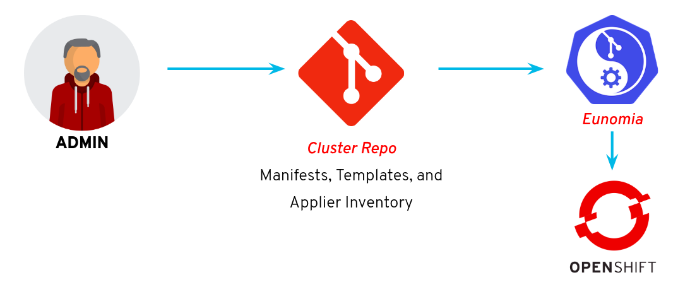

# How to Apply Infrastructure as Code Principles to OpenShift 4 Operationalization

In OpenShift 4, every cluster starts out the same way -- a bootstrapped control plane with 3 masters, and 3 compute nodes. But in order for this cluster to provide value to an organization, it needs further configuration. This repository is a reference implemntation that functions as a starting point for establishing an automated strategy for managing configuration of an operationalized cluster.

We've included examples of:

* Enabling Cluster Autoscaling
* Configuring authentication and authorization
* Managing namespace creation
* Setting up quotas & limits for applications
* Applying automated certificate management for applications
* Deploying some initial workloads
* Deploying some custom dashboards and setting up alerts

This repository can be consumed in one of two ways:

* [**As a reference implementation**](#quickstart) - Just follow the quickstart below on your own cluster
* [**As an interactive lab**](RHTE-LAB.adoc) - The lab will walk through the setup and a few example use cases in more detail.

## Quickstart

### Setting up the Git Ops Operator

_Git Ops_ is a form of Infrastructure as Code practice where all of the configurations that define a system are managed in a git repository, and automatically and idempotently applied to that system each time commits are made to the repository. For this lab, we are going to enable such a workflow using an Operator called [Eunomia](https://github.com/KohlsTechnology/eunomia) and [OpenShift Applier](https://github.com/redhat-cop/openshift-applier), and automation framework for OpenShift. Eunomia provides a workflow for watching git repos, triggering actions when new commits are detected. The action, in this case, will be a [Kubernetes Job](https://kubernetes.io/docs/tasks/job/) that executes Applier.

Let's go ahead and deploy Eunomia. We can do that via provided helm charts.

    git clone https://github.com/KohlsTechnology/eunomia.git
    helm template eunomia/deploy/helm/prereqs/ | oc apply -f -
    helm template eunomia/deploy/helm/operator/ --set eunomia.operator.openshift.route.enabled=true | oc apply -f -

### Creating Cluster Secrets

We are about to start managing clusters from configurations in a source code repository. However, we don't want to commit sensitive data to our repositories where someone might be able to see them. In an ideal enterprise scenario, we might integrate with some kind of Vault system to provide credentials for integrations that we would like to configure. In lieu of that, we are just going to feed our credentials to the cluster manually in the form of `Secrets`.

Obtain the following values for the LDAP server:

* LDAP URL
    * THe Address of the LDAP Server
* Bind User (DN)
    * User to authenticate against the LDAP instance
* Bind Password
    * The Password for the above user
* User Search Base
    * Location for which to start looking for users in the LDAP structure
* User Search Base
    * Location for which to start looking for groups in the LDAP structure
* User White List
    * Contents of a file containing only the users that should be synchronized

Apply the configurations to the cluster:

    ansible-playbook -i .applier/ galaxy/openshift-applier/playbooks/openshift-cluster-seed.yml \
    -e include_tags=ldap_auth \
    -e ldap_bind_dn="${ldap_bind_dn}" \
    -e ldap_url="${ldap_url}" \
    -e ldap_search_url="${ldap_search_url}"
    -e "ldap_groups_whitelist='$(cat whitelist)'" \
    -e ldap_groups_search_base='${ldap_groups_search_base}' \
    -e ldap_users_search_base="${ldap_users_search_base}"

### Initializing the GitOps Workflow

Now we can set up Eunomia to monitor a repo of configs, which in turn will apply configs to set up our cluster. Eunomia provides a CR called a `GitOpsConfig` to set up a monitor on a repository. You can examine the one we're going to use at [templates/cluster-gitops.yaml](templates/cluster-gitops.yaml). Let's use Applier to roll out the config.

    git clone https://github.com/redhat-cop/operationalizing-openshift-lab
    cd operationalizing-openshift-lab
    ansible-galaxy install -r requirements.yml -p galaxy
    ansible-playbook -i .applier/ galaxy/openshift-applier/playbooks/openshift-cluster-seed.yml -e include_tags=gitops

This run resulted in a namespace called `cluster-config` with our `GitOpsConfig` in it. From this, Eunomia spins up a job. Let's wait for that job to complete, and then see what we have.

    oc get jobs -n cluster-config

You should see one job created in this namespace. To follow the progress of the job, we need to find the pod running the job.

    oc get pods -n cluster-config

We should see that there is a pod running. Let's tail the logs of that pod.

    oc logs -f gitopsconfig-cluster-config-2bromv-wks8d -n cluster-config

From this we should see that there is an OpenShift Applier playbook running. This will roll out the rest of the configurations stored in this repo. Once that job completes successfully, we can explore what has been set up for us.

## Cluster Exploration

The above GitOps workflow will configure the following in your cluster, based on the configurations in this repo.

### MachineSets and AutoScalers

As part of this automation, we've configured machinesets and machine autoscalers. You can see them with the following commands.

    oc get machineautoscalers -n openshift-machine-api
    oc get machinesets -n openshift-machine-api
    oc get nodes

### Authentication and Authorization

#### LDAP Authentication

OpenShift provides the capability to authenticate users stored in LDAP systems using the [LDAP identity provider](https://docs.openshift.com/container-platform/4.1/authentication/identity_providers/configuring-ldap-identity-provider.html).

With the configurations applied, attempt to login with a user defined in the LDAP instance

    oc login -u <user> -p <password>

To login to the web console, locate the URL of the OpenShift web console and navigate to the URL presented

    oc whoami --show-console

Two login options are displayed. Select _LDAP_ and login with a valid username and password

If you are authenticated using both methods, the configurations were LDAP authentication was successful.

#### LDAP Group Synchronization

Many organizations that make use of LDAP directory services arrange their users into Groups. This allows Administrators the ability to apply the same set of permissions across multiple users. A similar concept can be applied using OpenShift's Role Based Access (RBAC) facility where multiple users can be organized into groups and roles can be applied. Since OpenShift can make use of users defined in LDAP servers, [groups defined in LDAP can be synchronized into OpenShift](https://docs.openshift.com/container-platform/4.1/authentication/ldap-syncing.html) so that preexisting structures can also be applied.

Since users, groups and their associated membership within the LDAP server changes frequently, it is important that the execution of the group synchronization process take place in a routine manner. While a job scheduler could be utilized, such as standalone [cron](https://en.wikipedia.org/wiki/Cron), OpenShift provides the facility to to execute tasks as _Jobs_ along with the repetitive execution of these jobs in a scheduled manner as a [CronJob](https://docs.openshift.com/container-platform/4.1/nodes/jobs/nodes-nodes-jobs.html). The process of executing the synchronization involves the use of the OpenShift command line tool which can triggered within a _CronJob_. A `LDAPSyncConfig` object defines how to connect to the LDAP instance from OpenShift along with the groups which should be synchronized.

As part of the GitOps automation, we deployed a Group Sync config. You can check the status of the _Job_.

    oc get jobs

The successful execution of the job will result in the _Completions_ field displaying `1/1`.

Verify LDAP groups have been synchronized into OpenShift

    oc get groups

The presence of groups and corresponding users indicate the successful completion of this iteration.

### Customized Project Creation

When a user creates a project in this cluster, we use the Namespace Configuration Operator to apply custom rules to that project.

The operator itself has been deployed to the cluster. You can examine the deployment with the following:

    oc describe deployment namespace-configuration-operator -n namespace-configuration-operator
    oc get pods -n namespace-configuration-operator
    oc logs -n namespace-configuration-operator $(oc get pod -n namespace-configuration-operator -o name)

When a user creates a project, custom rules will be applied. We can see this through the following commands.

    $ oc new-project test-project-policy
    $ oc get resourcequota
    NAME         CREATED AT
    large-size   2019-09-13T20:39:16Z

    $ oc get networkpolicy
    NAME                                 POD-SELECTOR   AGE
    allow-from-same-namespace            <none>         68s
    allow-network-policy-group-ingress   <none>         68s
