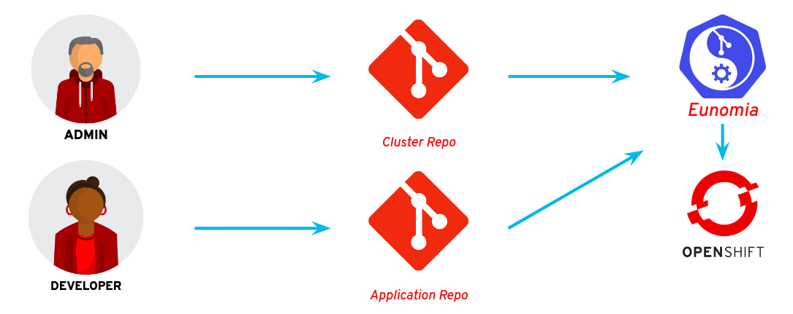

Operationalizing OpenShift Lab
==============================
:toc: macro

image::media/ops-workflow.png[]

toc::[]

In OpenShift 4, every cluster starts out the same way -- a bootstrapped control plane with master, and worker nodes.
However, in order for this cluster to provide value to an organization, it needs further configuration.

In this lab, we are going to develop a strategy for making these configurations and maintaining them over time.
We are going to employ the concepts of
link:https://openpracticelibrary.com/practice/everything-as-code/[Everything as Code^] and
link:https://thenewstack.io/what-is-gitops-and-why-it-might-be-the-next-big-thing-for-devops/[GitOps^]
to create self-managing OpenShift clusters, where the day 2 operations are done through
link:https://www.weave.works/blog/gitops-operations-by-pull-request[Pull Requests^].

Note that the purpose of this lab is not to teach how each of the components works individually, but to show how one can employ a common automation strategy to a myriad of different configurations.

Let's get started...

Provisioning your Lab Environment
---------------------------------

For Red Hat Tech Exchange, the GUID grabber link to get your lab environment is:

link:https://www.opentlc.com/gg/gg.cgi?profile=generic_rhte[^]

This lab code is "A2031", the activation code will be provided during the event.

If you are running through the lab on your own then you may provision an "OpenShift 4 Configuration" lab environment from link:https://labs.opentlc.com/[^].

:numbered:

GitOps Workflow for a Simple Use Case
-------------------------------------

_GitOps_ is a form of Infrastructure as Code practice where all of the configurations that define a system are managed in a git repository, and automatically and idempotently applied to that system each time commits are made to the repository.
For this lab, we are going to enable such a workflow using an Operator called link:https://github.com/KohlsTechnology/eunomia[Eunomia^] and link:https://github.com/redhat-cop/openshift-applier[OpenShift Applier^], an automation framework for OpenShift.
Eunomia provides a workflow for watching git repos, triggering actions when new commits are detected.
The action, in this case, will be a link:https://kubernetes.io/docs/tasks/job/[Kubernetes Job^] that executes Applier.

You will begin by configuring a simple and common task for OpenShift clusters, exposing the cluster's integrated image registry.
First you will configure a registry route manually and then build up to GitOps step by step.

Applying a Configuration
~~~~~~~~~~~~~~~~~~~~~~~~

. Check the initial state of the container image registry.
+
In your newly installed OpenShift cluster you will find the container image registry running in the `openshift-image-registry` project namespace.
There is an `image-registry` service, which is used for image access within the cluster, but there is no route for external access.
+
[subs=+quotes]
--------------------------------------------------------------------------------
$ **oc get service -n openshift-image-registry**
NAME             TYPE        CLUSTER-IP       EXTERNAL-IP   PORT(S)    AGE
image-registry   ClusterIP   172.30.151.126   <none>        5000/TCP   37m
$ **oc get route -n openshift-image-registry**
No resources found.
--------------------------------------------------------------------------------

. Use the `oc create route` command to create a route for the service:
+
It is a common practice to expose the OpenShift container image registry outside of the cluster so that CI/CD pipelines can
link:http://v1.uncontained.io/playbooks/continuous_delivery/image_promotion.html[move images between clusters as a form of Promotion^].
We can do this manually using the oc expose command.
+
[subs=+quotes]
--------------------------------------------------------------------------------
$ **oc create route reencrypt -n openshift-image-registry --service=image-registry**
route.route.openshift.io/image-registry created
--------------------------------------------------------------------------------

. Confirm the route has been created:
+
[subs=+quotes]
--------------------------------------------------------------------------------
$ **oc get route -n openshift-image-registry**
NAME            HOST/PORT                                                                         PATH  SERVICES        PORT      TERMINATION  WILDCARD
image-registry  image-registry-openshift-image-registry.apps.cluster-0b1e.sandbox506.opentlc.com        image-registry  5000-tcp  reencrypt    None
--------------------------------------------------------------------------------

. Attempt to reconfigure the route.
+
The hostname automatically assigned composed of the service name and the namespace.
A friendlier name would be to change the leading `image-registry-openshift-image-registry` to just `image-registry`.
+
Attempt to adjust the route with `oc create route`:
+
[subs=+quotes]
--------------------------------------------------------------------------------
$ **oc create route reencrypt -n openshift-image-registry --service=image-registry \
  --hostname=image-registry.apps.cluster-d8f5.sandbox1349.opentlc.com**
Error from server (AlreadyExists): routes.route.openshift.io "image-registry" already exists
--------------------------------------------------------------------------------
+
No luck, the `oc create route` command is not idempotent.
Many of the subcommands provided by `oc` are helpful for getting things started, but are not suited for maintaining your configuration later.
If we want to do it right we will need a workflow made from declarative configuration, not a series of commands.

. On your bastion, create a directory for your GitOps lab files in your home directory:
+
[subs=+quotes]
--------------------------------------------------------------------------------
$ **cd $HOME**
$ **mkdir openshift-gitops-lab**
$ **cd openshift-gitops-lab/**
--------------------------------------------------------------------------------

. Dump the route definition created by `oc create route` to a YAML file called `image-registry-route.yaml`:
+
[subs=+quotes]
--------------------------------------------------------------------------------
$ **oc get route -n openshift-image-registry -o yaml image-registry >image-registry-route.yaml**
--------------------------------------------------------------------------------
+
Then edit `image-registry-route.yaml`, removing everything except the bits you actually want to manage:
+
* Remove all content from the `metadata` section except `name` and `namespace`
* Remove `spec.subdomain`, it is empty and so not needed
* Remove `spec.to.weight`, the value 100 is just a default value and does not need to be managed
* Remove `spec.wildcardPolicy`, it is not needed, `None` is the default
* Remove the `status` section entirely
+
The result should look something like this, but with your own cluster domain for the host:
+
--------------------------------------------------------------------------------
apiVersion: route.openshift.io/v1
kind: Route
metadata:
  name: image-registry
  namespace: openshift-image-registry
spec:
  host: image-registry-openshift-image-registry.apps.cluster-d8f5.sandbox1349.opentlc.com
  port:
    targetPort: 5000-tcp
  tls:
    termination: reencrypt
  to:
    kind: Service
    name: image-registry
--------------------------------------------------------------------------------

. Apply your configuration to the cluster:
+
[subs=+quotes]
--------------------------------------------------------------------------------
$ **oc apply -f image-registry-route.yaml**
Warning: oc apply should be used on resource created by either oc create --save-config or oc apply
route.route.openshift.io/image-registry configured
--------------------------------------------------------------------------------
+
NOTE: The first run of `oc apply` will issue a warning and add an annotation to the resource that is used later to track changes.

. Now let's test that you can make our update to the short name.
+
Using a text editior, edit `image-registry-route.yaml` and shorten the hostname.
+
A `sed` command which makes this edit is:
+
[subs=+quotes]
--------------------------------------------------------------------------------
$ **sed -i \'s/image-registry-openshift-image-registry/image-registry/' image-registry-route.yaml**
--------------------------------------------------------------------------------
+
Now use `oc apply` to reconfigure the route:
+
[subs=+quotes]
--------------------------------------------------------------------------------
$ **oc apply -f image-registry-route.yaml**
route.route.openshift.io/image-registry configured
--------------------------------------------------------------------------------
+
And confirm that the route hostname has been updated:
+
[subs=+quotes]
--------------------------------------------------------------------------------
$ **oc get route -n openshift-image-registry**
NAME            HOST/PORT                                                PATH  SERVICES        PORT      TERMINATION  WILDCARD
image-registry  image-registry.apps.cluster-0b1e.sandbox506.opentlc.com        image-registry  5000-tcp  reencrypt    None
--------------------------------------------------------------------------------

Ansible Automation
~~~~~~~~~~~~~~~~~~

In this next section you will have a look at how to automate an `oc apply` based workflow with Ansible.
The configuration we put together so far is a bit brittle.
For example, if this were managing real clusters you would want to dynamically determin the application domain for cluster ingress.
Let's explore how that might look:

. Create a `templates` directory and move your static route definition to have a `.j2` file extension, indicating Jinja2 template content:
+
[subs=+quotes]
--------------------------------------------------------------------------------
$ **mkdir templates**
$ **mv image-registry-route.yaml templates/image-registry-route.j2**
--------------------------------------------------------------------------------

. Update the template content to use the variable `openshift_ingress_default_subdomain`:
+
[subs=+quotes]
--------------------------------------------------------------------------------
$ **sed -i \'s/^  host: .*/  host: image-registry.{{ openshift_ingress_default_subdomain }}/' \
   templates/image-registry-route.j2**
$ **cat templates/image-registry-route.j2**
apiVersion: route.openshift.io/v1
kind: Route
metadata:
  name: image-registry
  namespace: openshift-image-registry
spec:
  host: image-registry.{{ openshift_ingress_default_subdomain }}
  port:
    targetPort: 5000-tcp
  tls:
    termination: reencrypt
  to:
    kind: Service
    name: image-registry
--------------------------------------------------------------------------------

. Note that the `ingresscontroller` resource in the `openshift-ingress-operator` namespace has the cluster's domain:
+
[subs=+quotes]
--------------------------------------------------------------------------------
$ **oc get ingresscontroller -n openshift-ingress-operator default \
  -o custom-columns=DOMAIN:.status.domain**
DOMAIN
apps.cluster-742f.sandbox499.opentlc.com
--------------------------------------------------------------------------------

. Write the following simple Ansible role named `discover` to fetch the IngressController definition from the cluster and save the domain to the `openshift_ingress_default_subdomain` fact.
+
[subs=+quotes]
--------------------------------------------------------------------------------
$ **mkdir -p roles/discover/tasks**
$ **cat >roles/discover/tasks/main.yaml <<EOF
- name: Get default ingress controller
  k8s_facts:
    api_version:  operator.openshift.io/v1
    kind: IngressController
    name: default
    namespace: openshift-ingress-operator
  register: r_default_ingress_controller

- name: Set discovered facts
  set_fact:
    openshift_ingress_default_subdomain: >
      {{ r_default_ingress_controller.resources[0].status.domain }}
EOF**
--------------------------------------------------------------------------------

. Write a simple Ansible playbook to run the your `discover` role and then `oc apply` the resource definition from the template source:
+
[subs=+quotes]
--------------------------------------------------------------------------------
$ **cat >playbook.yaml <<EOF
- hosts: localhost
  roles:
  - discover
  tasks:
  - name: Apply image-registry route
    command: oc apply -f -
    args:
      stdin: "{{ lookup(\'template', \'image-registry-route.j2') }}"
EOF**
--------------------------------------------------------------------------------
+
But wait, you may say, "Why use `oc apply` when there is the `k8s` Ansible module?"
Well, `k8s` is great, and we probably will use it in the future, but right now it is missing one key feature, removing things.
The `oc apply` command will set an annotation, `kubectl.kubernetes.io/last-applied-configuration`, which records the last change made to the resource.
This allows `oc apply` to detect when a field should be removed because it was included in the last configuration but absent from the next.
+
[subs=+quotes]
--------------------------------------------------------------------------------
$ **ansible-playbook playbook.yaml**
 [WARNING]: provided hosts list is empty, only localhost is available. Note that the implicit localhost does not match 'all'

PLAY [localhost]

TASK [Gathering Facts]
ok: [localhost]

TASK [discover : Get default ingress controller]
ok: [localhost]

TASK [discover : Set discovered facts]
ok: [localhost]

TASK [Apply image-registry route]
changed: [localhost]

PLAY RECAP
localhost                  : ok=4    changed=1    unreachable=0    failed=0

--------------------------------------------------------------------------------
+
And that's it?
Well, this is the core principle, but to continue in this way will be reinventing the wheel.
The Red Hat containers community of practice has developed the Ansible role, `openshift-applier`.
The core of applier is just running `oc apply` like we have shown, but provides a standard approach and adds template processing and a whole lot more.

Enter `openshift-applier`
~~~~~~~~~~~~~~~~~~~~~~~~~

In these next steps you will organize what we have done so far into a simple example using `openshift-applier`.
You also begin your `git` journey.

. Create a new public GitHub repository:
+
link:https://github.com/new[^]
+
The instructions below assume that you name your repository "openshift-gitops-lab".
Make the repository public and do not initialize the repository.

. Configure your git client environment.
+
Before you start using git it is helpful to configure your git environment.
Set your `user.name`, `user.email`, and `push.default` settings, substituting
your name and email address in the following commands:
+
[subs=+quotes]
--------------------------------------------------------------------------------
$ **git config --global user.name "Your Name"**
$ **git config --global user.email you@example.com**
$ **git config --global push.default simple**
--------------------------------------------------------------------------------
+
Set a `GITHUB_ACCOUNT` variable with the name of your GitHub account.
+
[subs=+quotes]
--------------------------------------------------------------------------------
$ **export GITHUB_ACCOUNT=__YOUR_GITHUB_ACCOUNT__**
--------------------------------------------------------------------------------

. Create a `requirements.yml` configuration.
+
The OpenShift applier dynamically fetch role dependencies with `ansible-galaxy` based on the Ansible requirements definition.
+
[subs=+quotes]
--------------------------------------------------------------------------------
$ **cat >requirements.yml <<EOF
---
- src: https://github.com/redhat-cop/openshift-applier
  version: master

# The git repository for this project
- src: https://github.com/${GITHUB_ACCOUNT}/openshift-gitops-lab.git
  name: self
  version: master
EOF**
--------------------------------------------------------------------------------
+
The above should work if you named your repository "openshift-gitops-lab".
If you used something different, your can copy your source URL from GitHub by using the "Clone or download" button.

. Create a YAML vars file for the Ansible host group, `seed-hosts` with a definition of a dictionary `openshift_cluster_content`.
+
The `openshift_cluster_content` dictionary is used by `openshift-applier` as a main switch-board defining what to configure in the cluster and in what order.
+
[subs=+quotes]
--------------------------------------------------------------------------------
$ **mkdir -p .applier/group_vars/seed-hosts**
$ **cat >.applier/group_vars/seed-hosts/main.yml <<EOF
---
openshift_cluster_content:
- galaxy_requirements: "{{ inventory_dir }}/../requirements.yml"
- object: OpenShift Image Registry Configuration
  pre_steps:
  - role: self/roles/discover
  content:
  - name: Image Registry Route
    file: "{{ inventory_dir }}/../templates/image-registry-route.j2"
    tags:
    - image-registry
EOF**
--------------------------------------------------------------------------------

. Create an Ansible inventory which configures localhost as a member of the `seed-hosts` group:
+
[subs=+quotes]
--------------------------------------------------------------------------------
$ **cat >.applier/hosts <<EOF
[seed-hosts]
localhost ansible_connection=local
EOF**
--------------------------------------------------------------------------------

. Create a `meta/main.yml`
+
No real content here, but `openshift-applier` requires this file to exist as part of a sanity check it uses when pulling dependencies.
+
[subs=+quotes]
--------------------------------------------------------------------------------
$ **mkdir meta**
$ **cat >meta/main.yml <<EOF
---
galaxy_info:
EOF**
--------------------------------------------------------------------------------

. Create a `README.md`
+
Because every repository should have documentation.
+
[subs=+quotes]
--------------------------------------------------------------------------------
$ **echo "# OpenShift GitOps Lab" >> README.md**
--------------------------------------------------------------------------------

. Commit all of your code and push to your GitHub repository
+
First, initialize your directory for `git`:
+
[subs=+quotes]
--------------------------------------------------------------------------------
$ **git init**
Initialized empty Git repository in /home/lab-user/openshift-gitops-lab/.git/
--------------------------------------------------------------------------------
+
Add all required files for commit:
+
[subs=+quotes]
--------------------------------------------------------------------------------
$ **git add README.md requirements.yml .applier/ meta roles/ templates/**
--------------------------------------------------------------------------------
+
Commit to your local repository:
+
[subs=+quotes]
--------------------------------------------------------------------------------
$ **git commit -m "Initial commit"**
[master 4b2e3e0] Initial commit
 7 files changed, 47 insertions(+)
 create mode 100644 .applier/group_vars/seed-hosts/main.yml
 create mode 100644 .applier/hosts
 create mode 100644 README.md
 create mode 100644 meta/main.yml
 create mode 100644 requirements.yml
 create mode 100644 roles/discover/tasks/main.yaml
 create mode 100644 templates/image-registry-route.j2
--------------------------------------------------------------------------------
+
Add a remote to connect your local repository to your GitHub repository:
+
[subs=+quotes]
--------------------------------------------------------------------------------
$ **git remote add origin https://github.com/${GITHUB_ACCOUNT}/openshift-gitops-lab.git**
--------------------------------------------------------------------------------
+
And finally push to GitHub:
+
[subs=+quotes]
--------------------------------------------------------------------------------
$ **git push --set-upstream origin master**
Username for \'https://github.com': **__GITHUB_ACCOUNT__**
Password for \'https://__GITHUB_ACCOUNT__@github.com':
Counting objects: 17, done.
Delta compression using up to 2 threads.
Compressing objects: 100% (9/9), done.
Writing objects: 100% (17/17), 1.57 KiB | 0 bytes/s, done.
Total 17 (delta 0), reused 0 (delta 0)
To https://github.com/__GITHUB_ACCOUNT__/openshift-gitops-lab.git
 * [new branch]      master -> master
Branch master set up to track remote branch master from origin.
--------------------------------------------------------------------------------

. Pull down a local copy of `openshift-applier` and test your `requirements.yml`:
+
[subs=+quotes]
--------------------------------------------------------------------------------
$ **ansible-galaxy install -r requirements.yml -p galaxy**
- extracting openshift-applier to /home/lab-user/openshift-gitops-lab/galaxy/openshift-applier
- openshift-applier (master) was installed successfully
- extracting self to /home/lab-user/openshift-gitops-lab/galaxy/self
- self (master) was installed successfully
--------------------------------------------------------------------------------
+
NOTE: This step creates a `galaxy` subdirectory within your git repository.
You should create a `.gitignore` configuration to exclude these files from later `git` activity.
(link:https://git-scm.com/docs/gitignore[^])

. Run `openshift-applier` using the `openshift-cluster-seed.yml` playbook.
+
[subs=+quotes]
--------------------------------------------------------------------------------
$ **ansible-playbook -i .applier/ galaxy/openshift-applier/playbooks/openshift-cluster-seed.yml**
PLAY [seed-hosts[0]]

... OUTPUT OMITTED ...

RUNNING HANDLER [openshift-applier : Clean up temporary dependency dir]
changed: [localhost] => (item=/tmp/ansible.dO3wGX/)

RUNNING HANDLER [openshift-applier : Clean up temporary Jinja directory]
changed: [localhost] => (item=/tmp/ansible.aXO00w)

PLAY RECAP
localhost                  : ok=36   changed=9    unreachable=0    failed=0
--------------------------------------------------------------------------------
+
And now you're working with the OpenShift applier and ready to start contributing to the Red Hat containers community of practice!
+
Let's get on to GitOps now!

Install Eunomia
~~~~~~~~~~~~~~

In this section of the lab we install Eunomia following the installation instructions provided in the
link:https://github.com/KohlsTechnology/eunomia/blob/master/README.md[Eunomia README.md^].

. You will install the Eunomia operator using a provided link:https://helm.sh[Helm^] template.
Install the `helm` command into your `~/bin` directory.
+
[subs=+quotes]
--------------------------------------------------------------------------------
$ *mkdir ~/bin*
$ *curl https://get.helm.sh/helm-v2.14.3-linux-amd64.tar.gz \
  | tar xzf - -C ~/bin --strip-components=1 linux-amd64/helm*
  % Total    % Received % Xferd  Average Speed   Time    Time     Time  Current
                                 Dload  Upload   Total   Spent    Left  Speed
100 23.0M  100 23.0M    0     0  18.8M      0  0:00:01  0:00:01 --:--:-- 12.0M
$ *ls -l ~/bin/helm*
-rwxr-xr-x. 1 lab-user users 41819776 Jul 30 16:35 /home/<lab_user>-redhat.com/bin/helm*
--------------------------------------------------------------------------------
NOTE: This command only installs the `helm` executible from the release.
The `tiller` component of Helm is not needed to install Eunomia which eliminates the security implications that would be required by making use of this component.

. From your HOME directory, clone Eunomia from the KohlsTechnology git repository:
+
[subs=+quotes]
--------------------------------------------------------------------------------
$ **cd $HOME**
$ **git clone https://github.com/KohlsTechnology/eunomia.git**
Cloning into 'eunomia'...
remote: Enumerating objects: 888, done.
remote: Total 888 (delta 0), reused 0 (delta 0), pack-reused 888
Receiving objects: 100% (888/888), 1.45 MiB | 174.00 KiB/s, done.
Resolving deltas: 100% (412/412), done.
--------------------------------------------------------------------------------

. Process the Eunomia prerequisites with `helm template` and pass the output resource definitions to `oc apply`:
+
[subs=+quotes]
--------------------------------------------------------------------------------
$ *helm template eunomia/deploy/helm/prereqs/ | oc apply -f -*
namespace/eunomia-operator created
customresourcedefinition.apiextensions.k8s.io/gitopsconfigs.eunomia.kohls.io created
clusterrole.rbac.authorization.k8s.io/gitopsconfig-admin created
clusterrole.rbac.authorization.k8s.io/gitopsconfig-viewer created
clusterrole.rbac.authorization.k8s.io/eunomia-operator created
clusterrolebinding.rbac.authorization.k8s.io/eunomia-operator created
--------------------------------------------------------------------------------

. Process the Eunomia operator directory with `helm template` and pass the output resource definitions to `oc apply`:
+
[subs=+quotes]
--------------------------------------------------------------------------------
$ **helm template eunomia/deploy/helm/operator/ \
  --set eunomia.operator.openshift.route.enabled=true \
  --set eunomia.operator.image.tag=v0.0.1 \
  --set eunomia.operator.image.pullPolicy=IfNotPresent | oc apply -f -**
configmap/eunomia-templates created
serviceaccount/eunomia-operator created
rolebinding.rbac.authorization.k8s.io/eunomia-operator created
role.rbac.authorization.k8s.io/eunomia-operator created
service/eunomia-operator created
deployment.apps/eunomia-operator created
--------------------------------------------------------------------------------

. Check Eunomia operator is running:
+
[subs=+quotes]
--------------------------------------------------------------------------------
$ **oc get pod -n eunomia-operator**
NAME                               READY   STATUS    RESTARTS   AGE
eunomia-operator-994b5d88d-ks6kw   1/1     Running   0          11m
$ **oc logs -n eunomia-operator $(oc get pod -n eunomia-operator -o name)**
{"level":"info","ts":1568215406.310659,"logger":"cmd","msg":"Go Version: go1.12.6"}
{"level":"info","ts":1568215406.3106856,"logger":"cmd","msg":"Go OS/Arch: linux/amd64"}
{"level":"info","ts":1568215406.3106892,"logger":"cmd","msg":"Version of operator-sdk: v0.8.1"}
{"level":"info","ts":1568215406.3113315,"logger":"cmd","msg":"Templates initialized correctly"}
{"level":"info","ts":1568215406.3116016,"logger":"leader","msg":"Trying to become the leader."}
{"level":"info","ts":1568215406.4215379,"logger":"leader","msg":"No pre-existing lock was found."}
{"level":"info","ts":1568215406.4294758,"logger":"leader","msg":"Became the leader."}
{"level":"info","ts":1568215406.5258887,"logger":"cmd","msg":"Registering Components."}
{"level":"info","ts":1568215406.526105,"logger":"kubebuilder.controller","msg":"Starting EventSource","controller":"gitopsconfig-controller","source":"kind source: /, Kind="}
{"level":"info","ts":1568215406.5262187,"logger":"kubebuilder.controller","msg":"Starting EventSource","controller":"gitopsconfig-controller","source":"channel source: 0xc00096e7d0"}
{"level":"info","ts":1568215406.5262578,"logger":"cmd","msg":"Starting the Web Server"}
{"level":"info","ts":1568215406.5262656,"logger":"cmd","msg":"Starting the Cmd."}
{"level":"info","ts":1568215406.6265268,"logger":"kubebuilder.controller","msg":"Starting Controller","controller":"gitopsconfig-controller"}
{"level":"info","ts":1568215406.7266388,"logger":"kubebuilder.controller","msg":"Starting workers","controller":"gitopsconfig-controller","worker count":1}
--------------------------------------------------------------------------------
+
Eunomia is now running, but does not yet have any configuration for GitOps processing.

Running Applier with Eunomia
~~~~~~~~~~~~~~~~~~~~~~~~~~~~

Now, you can set up eunomia to leverage your `openshift-gitops-lab` repository to run `openshift-applier` for you.
In this section of the lab you will setup the GitOps configuration manually.
Later in the lab you will see how you can use `openshift-applier` to automatically configure or reconfigure the GitOps configuration.

. Delete the route for the image-registry so that you can confirm that the Eunomia successfully reconfigures it:
+
[subs=+quotes]
--------------------------------------------------------------------------------
$ **oc delete route -n openshift-image-registry image-registry**
route.route.openshift.io "image-registry" deleted
--------------------------------------------------------------------------------

. Configure Eunomia to configure your cluster with your `openshift-gitops-lab` repository:
+
Create the project namespace, `cluster-config`, for managing your GitOps cluster configuration:
+
[subs=+quotes]
--------------------------------------------------------------------------------
$ **oc new-project cluster-config**
Now using project "cluster-config" on server "https://api.cluster-742f.sandbox499.opentlc.com:6443".

You can add applications to this project with the 'new-app' command. For example, try:

    oc new-app django-psql-example

to build a new example application in Python. Or use kubectl to deploy a simple Kubernetes application:

    kubectl create deployment hello-node --image=gcr.io/hello-minikube-zero-install/hello-node

--------------------------------------------------------------------------------
+
Create a service account for the Eunomia template processor:
+
[subs=+quotes]
--------------------------------------------------------------------------------
$ **oc create serviceaccount -n cluster-config gitops-runner**
serviceaccount/gitops-runner created
--------------------------------------------------------------------------------
+
Grant the service account whatever rights it will need to configure resources:
+
[subs=+quotes]
--------------------------------------------------------------------------------
$ **oc adm policy add-cluster-role-to-user cluster-admin system:serviceaccount:cluster-config:gitops-runner**
clusterrole.rbac.authorization.k8s.io/cluster-admin added: "system:serviceaccount:cluster-config:gitops-runner"
--------------------------------------------------------------------------------
+
Create a `GitOpsConfig` for Eunomia that points to your `openshift-gitops-lab` repository and uses the `quay.io/kohlstechnology/eunomia-applier:v0.0.1` template processor:
+
[subs=+quotes]
--------------------------------------------------------------------------------
$ **oc apply -f - <<EOF
apiVersion: eunomia.kohls.io/v1alpha1
kind: GitOpsConfig
metadata:
  name: openshift-gitops-lab
  namespace: cluster-config
spec:
  templateSource:
    uri: https://github.com/${GITHUB_ACCOUNT}/openshift-gitops-lab.git
    ref: master
  triggers:
  - type: Change
  - type: Periodic
    cron: "@hourly"
  serviceAccountRef: gitops-runner
  templateProcessorImage: quay.io/kohlstechnology/eunomia-applier:v0.0.1
  resourceHandlingMode: None
  resourceDeletionMode: None
EOF**
gitopsconfig.eunomia.kohls.io/openshift-gitops-lab created
--------------------------------------------------------------------------------
+
NOTE: Oh no! The commands `oc create serviceaccount`, `oc adm policy add-cluster-role-to-user`, and even our `oc apply` command do not follow GitOps practices.
Never fear, we can and will show how to do it the GitOps way soon!

. Check Eunomia job completion.
+
The change trigger on the GitOpsConfig will cause Eunomia to immediately process by creating a kubernetes job in the same directory as the GitOpsConfig.
+
[subs=+quotes]
--------------------------------------------------------------------------------
$ **oc get job -n cluster-config**
NAME                                       COMPLETIONS   DURATION   AGE
gitopsconfig-openshift-gitops-lab-jkadel   1/1           51s        2m30s
--------------------------------------------------------------------------------
+
The Eunomia job log shows you the setup from git and then the output of Ansible running the `openshift-applier` role against your repository:
+
[subs=+quotes]
--------------------------------------------------------------------------------
$ **oc logs -n cluster-config -f job/gitopsconfig-openshift-gitops-lab-jkadel**
Cloning Repositories
Cloning into '/git/templates'...
Cloning into '/git/parameters'...
Setting cluster-related environment variable
Context "current" created.
Switched to context "current".
Error from server (NotFound): routes.route.openshift.io "docker-registry" not found
Processing Parameters
- extracting openshift-applier to /git/templates/galaxy/openshift-applier
- openshift-applier (master) was installed successfully
- extracting self to /git/templates/galaxy/self
- self (master) was installed successfully

... OUTPUT OMITTED ...

RUNNING HANDLER [openshift-applier : Clean up temporary dependency dir]
changed: [localhost] => (item=/tmp/ansible.RFC9qm/)

RUNNING HANDLER [openshift-applier : Clean up temporary Jinja directory]
changed: [localhost] => (item=/tmp/ansible.reO3Mm)

PLAY RECAP
localhost                  : ok=36   changed=9    unreachable=0    failed=0    skipped=34   rescued=0    ignored=0

CREATE_MODE and/or DELETE_MODE is set to None; This means that the template processor already applied the resources. Skipping the Manage Resources step.
--------------------------------------------------------------------------------

. Finally, confirm that the route hostname has been recreated as expected:
+
[subs=+quotes]
--------------------------------------------------------------------------------
$ **oc get route -n openshift-image-registry**
NAME            HOST/PORT                                                PATH  SERVICES        PORT      TERMINATION  WILDCARD
image-registry  image-registry.apps.cluster-0b1e.sandbox506.opentlc.com        image-registry  5000-tcp  reencrypt    None
--------------------------------------------------------------------------------

GitOps Workflow for a complex use case as a Cluster Administration
------------------------------------------------------------------

In this next section of the lab you will begin working with a full-featured OpenShift GitOps repository.
The link:https://github.com/redhat-cop/operationalizing-openshift-lab/[operationalizing-openshift-lab^]
repository includes a collection of best practices examples developed by the Red Hat containers community of practice.

Using this repository as a starting point we are going to establish an automated strategy for managing configuration of an operationalized cluster, including things like:

* Enabling Cluster Autoscaling
* Configuring authentication and authorization
* Configuring namespace creation
* Setting up quotas & limits for applications
* Applying automated certificate management for applications
* Deploying initial workloads
* Deploying custom dashboards and setting up alerts

Red Hat Containers Community of Practice GitOps Repository
~~~~~~~~~~~~~~~~~~~~~~~~~~~~~~~~~~~~~~~~~~~~~~~~~~~~~~~~~~

In this configuration you will see an `openshift-applier` inventory that is configured with the ability to bootstrap its own GitOps configuration.
You can examine the one we're going to use at link:templates/cluster-gitops.yaml[templates/cluster-gitops.yaml].
Let's use Applier to roll out the config.

. First, let's verify our `GITHUB_ACCOUNT` environment variable is still set.
+
[subs=+quotes]
--------------------------------------------------------------------------------
$ **export GITHUB_ACCOUNT=__YOUR_GITHUB_ACCOUNT__**
--------------------------------------------------------------------------------

. Fork the link:https://github.com/redhat-cop/operationalizing-openshift-lab/[operationalizing-openshift-lab^] repository into your own account by selecting the *Fork* button and then if necessary, select the account for which the repository should be forked to.

. Clone your fork locally using the `GITHUB_ACCOUNT` variable you set previously:
+
[subs=+quotes]
--------------------------------------------------------------------------------
$ **git clone https://github.com/${GITHUB_ACCOUNT}/operationalizing-openshift-lab**
Cloning into \'operationalizing-openshift-lab'...
remote: Enumerating objects: 77, done.
remote: Counting objects: 100% (77/77), done.
remote: Compressing objects: 100% (44/44), done.
remote: Total 323 (delta 36), reused 62 (delta 29), pack-reused 246
Receiving objects: 100% (323/323), 78.45 KiB | 0 bytes/s, done.
Resolving deltas: 100% (129/129), done.
--------------------------------------------------------------------------------

. Update repository references in source to make use of your GitHub account instead of the upstream repository.
+
There are references to the repository in `requirements.yml` and `templates/cluster-gitops.yaml`.
The `templates/cluster-gitops.yaml` will be used to configure Eunomia to point to your repository.
+
[subs=+quotes]
--------------------------------------------------------------------------------
$ *cd ~/operationalizing-openshift-lab*
$ *sed -i "s|https://github.com/redhat-cop/operationalizing-openshift-lab|https://github.com/${GITHUB_ACCOUNT}/operationalizing-openshift-lab|" \
  requirements.yml templates/cluster-gitops.yaml*
--------------------------------------------------------------------------------

. The LDAP authentication and group sync configuration for this lab will communicate with an link:https://access.redhat.com/products/identity-management[IPA^] server in a secure fashion.
Download the OpenTLC shared IPA TLS certificate authority that will be used to facilitate the communication:
+
[subs=+quotes]
--------------------------------------------------------------------------------
$ *curl http://ipa.shared.example.opentlc.com/ipa/config/ca.crt -o ldap-ca.crt*
  % Total    % Received % Xferd  Average Speed   Time    Time     Time  Current
                                 Dload  Upload   Total   Spent    Left  Speed
100  1350  100  1350    0     0   6597      0 --:--:-- --:--:-- --:--:--  6617
--------------------------------------------------------------------------------

. Set LDAP configuration variables for the lab.
The `openshift-applier` Ansible role used for GitOps in this lab uses an Ansible inventory store in the `.ansible/` directory of your repository.
The ansible host group, `seed-hosts`, is configured with group variables in YAML in the `.applier/group_vars/seed-hosts/` directory.
Within this directory the variables are managed in separate YAML files, organized by the purpose of the variables.
An example `auth.yml` file is provided with the lab repository for reference.
The LDAP settings used for this lab can be set by running the command below.
+
[subs=+quotes]
--------------------------------------------------------------------------------
$ **cat >.applier/group_vars/seed-hosts/auth.yml <<EOF
# LDAP server URL
ldap_url: "ldap://ipa.shared.example.opentlc.com"

# TLS certificate authority by Ansible file lookup
ldap_ca: >-
  {{ lookup("file", inventory_dir ~ "/../ldap-ca.crt") }}

# LDAP BIND config for user authentication and groups sync
ldap_bind_dn: uid=admin,cn=users,cn=accounts,dc=shared,dc=example,dc=opentlc,dc=com

# Do not store secrets in version control!
# LDAP bind password configured by environment variable
ldap_bind_password: >-
  {{ lookup("env", "LDAP_BIND_PASSWORD") }}

# Location in LDAP for users and groups
ldap_users_search_base: cn=users,cn=accounts,dc=shared,dc=example,dc=opentlc,dc=com
ldap_groups_search_base: cn=groups,cn=accounts,dc=shared,dc=example,dc=opentlc,dc=com

# LDAP search filter URL used during authentication
ldap_search_url: "{{ ldap_url }}/{{ ldap_users_search_base }}?uid?sub?{{ ldap_auth_search_filter }}"

# This search filter enforces that users must belong to the ocp-users group
ldap_auth_search_filter: "(memberOf=cn=ocp-users,cn=groups,cn=accounts,dc=shared,dc=example,dc=opentlc,dc=com)"

# LDAP group sync schedule configuration
ldap_cron_schedule: "*/5 * * * *"

# LDAP groups whitelist restricts groups synced from LDAP to OpenShift
ldap_groups_whitelist: |
  cn=ocp-users,cn=groups,cn=accounts,dc=shared,dc=example,dc=opentlc,dc=com
  cn=ocp-platform,cn=groups,cn=accounts,dc=shared,dc=example,dc=opentlc,dc=com
  cn=ocp-production,cn=groups,cn=accounts,dc=shared,dc=example,dc=opentlc,dc=com
  cn=paymentapp,cn=groups,cn=accounts,dc=shared,dc=example,dc=opentlc,dc=com
  cn=portalapp,cn=groups,cn=accounts,dc=shared,dc=example,dc=opentlc,dc=com
EOF**
--------------------------------------------------------------------------------

. Commit and push changes to your Git repository:
+
Add files with changes to be included in next commit:
+
[subs=+quotes]
--------------------------------------------------------------------------------
$ *git add .applier/group_vars/seed-hosts/auth.yml ldap-ca.crt \
    requirements.yml templates/cluster-gitops.yaml*
--------------------------------------------------------------------------------
+
Commit changes to your git working directory:
+
[subs=+quotes]
--------------------------------------------------------------------------------
$ *git commit -m "Update settings for initial lab run"*
[master 9d96661] Update settings for initial lab run
 4 files changed, 59 insertions(+), 29 deletions(-)
 rewrite .applier/group_vars/seed-hosts/auth.yml (76%)
 create mode 100644 ldap-ca.crt
--------------------------------------------------------------------------------
+
Push your commit to your GitHub repository, authenticating when prompted:
+
[subs=+quotes]
--------------------------------------------------------------------------------
$ *git push origin master*
Username for \'https://github.com': **__GITHUB_ACCOUNT__**
Password for \'https://__GITHUB_ACCOUNT__@github.com':
Counting objects: 18, done.
Delta compression using up to 2 threads.
Compressing objects: 100% (9/9), done.
Writing objects: 100% (10/10), 2.10 KiB | 0 bytes/s, done.
Total 10 (delta 5), reused 1 (delta 0)
remote: Resolving deltas: 100% (5/5), completed with 5 local objects.
To https://github.com/__GITHUB_ACCOUNT__/operationalizing-openshift-lab
   a46e90f..3fa37a4  master -> master
--------------------------------------------------------------------------------
+
NOTE: If your GitHub account is configured for two-factor authentication then you will need to configure a
link:https://help.github.com/en/articles/creating-a-personal-access-token-for-the-command-line[GitHub personal access token^] to authenticate for the `git push` command.

Configure Eunomia
~~~~~~~~~~~~~~~~

You will configure Eunomia using `openshift-applier` using the same repository that will be used by Eunomia.
This means that once complete, Eunomia will be able to reconfigure itself on the running cluster.
This also means that all configuration can be processed and validated using `openshift-applier` outside of Eunomia.

. Install `openshift-applier` into the `galaxy` directory using the `ansible-galaxy` command line tool using the provided `requirements.yml`:
+
[subs=+quotes]
--------------------------------------------------------------------------------
$ *ansible-galaxy install -r requirements.yml -p galaxy*
- extracting openshift-applier to /home/lab-user/operationalizing-openshift-lab/galaxy/openshift-applier
- openshift-applier (master) was installed successfully
- extracting self to /home/lab-user/operationalizing-openshift-lab/galaxy/self
- self (master) was installed successfully
--------------------------------------------------------------------------------
+
This step also validates that your GitOps repository `requirements.yml` is correctly configured.

. Set and export the `LDAP_BIND_PASSWORD` environment variable as it will be added to the set of cluster _secrets_ required in later portions of the lab:
+
[subs=+quotes]
--------------------------------------------------------------------------------
$ *export LDAP_BIND_PASSWORD=xxxxxx*
--------------------------------------------------------------------------------
+
NOTE: The LDAP bind password is included in the authentication unit of the "Red Hat OpenShift Container Platform 4 Configuration" course in the learning management system.

. Configure cluster secrets by running `openshift-applier` with the objects tagged "cluster-secrets".
+
This step configures values that will not be available during Eunomia processing.
In this lab this is just the LDAP bind password.
+
[subs=+quotes]
--------------------------------------------------------------------------------
$ *ansible-playbook -i .applier/ galaxy/openshift-applier/playbooks/openshift-cluster-seed.yml \
  -e include_tags=cluster-secrets -e exclude_tags=""*
--------------------------------------------------------------------------------
+
NOTE: We must override `exclude_tags` to set cluster secrets because this variable is set in `.applier/group_vars/seed-hosts/main.yml` to exclude the `cluster-secrets` tag.

. Kick off Eunomia by running `openshift-applier` with the objects tagged "gitops":
+
[subs=+quotes]
--------------------------------------------------------------------------------
$ *ansible-playbook -i .applier/ galaxy/openshift-applier/playbooks/openshift-cluster-seed.yml \
  -e include_tags=gitops*
--------------------------------------------------------------------------------

. *Wait for nodes to come back*. By running the above command, you've kicked off a Eunomia run. This run will create a Kubernetes `Job` that runs OpenShift Applier against your repo. One of the items this repo is configured to manage is your OpenShift `MachineSets`. By default, OpenShift nodes are designated either as a `master` (designated by the label `node-role.kubernetes.io/master=`) or a `worker` (designated by the label `node-role.kubernetes.io/master=`). For our cluster we would like to further configure a layer of isolation: designated `compute` and `logging` worker nodes. In order to do that, we replace the default `MachineSets`, which will re-provision all of the nodes, including the master. Let's watch this happen. First, we'll run `watch oc get machinesets` until the output looks something like this.
+
[subs=+quotes]
----
$ *watch oc get machinesets -n openshift-machine-api*
Every 2.0s: oc get machinesets -n openshift-machine-api                                                                                                                                                                            Wed Sep 25 08:03:13 2019

NAME                                       DESIRED   CURRENT   READY   AVAILABLE   AGE
cluster-8fa0-9gfz9-compute-eu-west-1a      1         1                             3m33s
cluster-8fa0-9gfz9-compute-eu-west-1b      1         1                             3m33s
cluster-8fa0-9gfz9-compute-eu-west-1c      0         0                             3m33s
cluster-8fa0-9gfz9-logging-es-eu-west-1a   1         1                             3m33s
cluster-8fa0-9gfz9-logging-es-eu-west-1b   0         0                             3m33s
cluster-8fa0-9gfz9-logging-es-eu-west-1c   0         0                             3m33s
cluster-8fa0-9gfz9-worker-eu-west-1a       0         0                             18h
cluster-8fa0-9gfz9-worker-eu-west-1b       0         0                             18h
cluster-8fa0-9gfz9-worker-eu-west-1c       0         0                             18h
----

. Next, we can `watch oc get nodes` until all of our new nodes are ready.
+
[subs=+quotes]
----
$ *watch oc get nodes*
Every 2.0s: oc get nodes                                                                                                                                                                                              Wed Sep 25 08:03:13 2019

NAME                                         STATUS                     ROLES    AGE   VERSION
ip-10-0-128-223.eu-west-1.compute.internal   Ready                      master   18h   v1.13.4+ab8449285
ip-10-0-159-213.eu-west-1.compute.internal   Ready                      master   18h   v1.13.4+ab8449285
ip-10-0-167-35.eu-west-1.compute.internal    Ready,SchedulingDisabled   worker   18h   v1.13.4+ab8449285
ip-10-0-168-183.eu-west-1.compute.internal   Ready                      master   18h   v1.13.4+ab8449285
----

. Check Eunomia Configuration created by `openshift-applier`.
+
You should find a GitOpsConfig resource has been created in the `cluster-config` namespace.
Check the references to your GitHub repository in the GitOpsConfig:
+
[subs=+quotes]
--------------------------------------------------------------------------------
$ *oc get gitopsconfig cluster-config -n cluster-config -o yaml*
apiVersion: eunomia.kohls.io/v1alpha1
kind: GitOpsConfig
metadata:
  annotations:
    gitopsconfig.eunomia.kohls.io/initialized: "true"
    kubectl.kubernetes.io/last-applied-configuration: |
      {"apiVersion":"eunomia.kohls.io/v1alpha1","kind":"GitOpsConfig","metadata":{"annotations":{},"name":"cluster-config","namespace":"cluster-config"},"spec":{"resourceDeletionMode":"None","resourceHandlingMode":"None","serviceAccountRef":"eunomia-runner","templateProcessorImage":"quay.io/kohlstechnology/eunomia-applier:v0.0.1","templateSource":{"contextDir":"","ref":"master","uri":"https://github.com/__GITOPS_ACCOUNT__/operationalizing-openshift-lab"},"triggers":[{"type":"Change"}]}}
  creationTimestamp: "2019-09-11T19:22:09Z"
  finalizers:
  - eunomia-finalizer
  generation: 3
  name: cluster-config
  namespace: cluster-config
  resourceVersion: "2412063"
  selfLink: /apis/eunomia.kohls.io/v1alpha1/namespaces/cluster-config/gitopsconfigs/cluster-config
  uid: 73008724-d4c9-11e9-8b21-0665501aae14
spec:
  parameterSource:
    contextDir: .
    ref: master
    uri: https://github.com/__GITHUB_ACCOUNT__/operationalizing-openshift-lab
  resourceDeletionMode: None
  resourceHandlingMode: None
  serviceAccountRef: eunomia-runner
  templateProcessorImage: quay.io/kohlstechnology/eunomia-applier:v0.0.1
  templateSource:
    contextDir: ""
    ref: master
    uri: https://github.com/__GITHUB_ACCOUNT__/operationalizing-openshift-lab
  triggers:
  - type: Change
--------------------------------------------------------------------------------

. Check Eunomia job completion.
+
The change trigger on the GitOpsConfig will cause Eunomia to immediately process by creating a kubernetes job in the same directory as the GitOpsConfig.
+
[subs=+quotes]
--------------------------------------------------------------------------------
$ *oc get job -n cluster-config*
NAME                                 COMPLETIONS   DURATION   AGE
gitopsconfig-cluster-config-gtvzhi   1/1           52s        2m50s
--------------------------------------------------------------------------------
+
The Eunomia job log shows the output of `openshift-applier` running the same Ansible playbook as we used to configure cluster secrets and gitops:
+
[subs=+quotes]
--------------------------------------------------------------------------------
$ *oc logs -n cluster-config job/gitopsconfig-cluster-config-gtvzhi --tail=10*

RUNNING HANDLER [openshift-applier : Clean up temporary Jinja directory]
changed: [localhost] => (item=/tmp/ansible.LY8psZ)

PLAY RECAP
localhost                  : ok=162  changed=22   unreachable=0    failed=0    skipped=189  rescued=0    ignored=0

Managing Resources
Context "current" modified.
Switched to context "current".
--------------------------------------------------------------------------------
+
NOTE: The configuration performed by this first job run reconfigures the openshift-machine-api, resulting in the worker nodes being replaced.
It is possible that the node where the job ran will terminate before the logs can be retrieved.
It may take up to 6 minutes for the cluster to create the replacement nodes.
You may watch for the new nodes to become available with `oc get nodes -w`.

=== Exploring Your Newly Configured Cluster

At this point we expect to have a working GitOps workflow for our shiny new cluster. Let's take a few moments to examine the state of our cluster in greater detail.

For this part of the Lab, we are going to take on the persona of *David*, a cluster administrator. Let's log in as `david`.

[subs=+quotes]
----
$ *oc whoami --show-server*
https://api.cluster-*<guid>*.*<guid>*.sandbox<nnn>.opentlc.com:6443

$ *oc login -u david $(oc whoami --show-server)*
Logged into "https://api.cluster-<guid>.<guid>.sandbox<nnn>.opentlc.com:6443" as "david" using existing credentials.

You have access to 59 projects, the list has been suppressed. You can list all projects with 'oc projects'

Using project "default".

----

==== Authentication and Authorization

One of the first things we've done in this cluster is configured multi-user authentication to an external LDAP provider. This will allow us to have multiple different users logged into our cluster with various roles and policies applied.

Let's confirm that our workflow has reconfigured the cluster by testing login.

First confirm that the OAuth configuration has been updated.
The oauth resource named "cluster" should have the `spec.identityProviders` now configured for LDAP authentication:

[subs=+quotes]
--------------------------------------------------------------------------------
$ **oc get oauth cluster -o yaml | grep identityProviders: -A22**
  identityProviders:
  - challenge: true
    ldap:
      attributes:
        email:
        - mail
        id:
        - dn
        name:
        - cn
        preferredUsername:
        - uid
      bindDN: uid=admin,cn=users,cn=accounts,dc=shared,dc=example,dc=opentlc,dc=com
      bindPassword:
        name: ldap-bind-password
      ca:
        name: ldap-tls-ca
      insecure: false
      url: ldap://ipa.shared.example.opentlc.com/cn=users,cn=accounts,dc=shared,dc=example,dc=opentlc,dc=com?uid?sub?(memberOf=cn=ocp-users,cn=groups,cn=accounts,dc=shared,dc=example,dc=opentlc,dc=com)
    login: true
    mappingMethod: claim
    name: LDAP
    type: LDAP
--------------------------------------------------------------------------------

We can also observe that we have several `Groups` already synced in our cluster

[subs=+quotes]
----
$ *oc get groups*
NAME             USERS
ocp-platform     david, admin1, admin2, admin
ocp-production   karla, prod1, prod2, admin
ocp-users        andrew, marina, karla, david, portal1, portal2, payment1, payment2, prod1, prod2, platform1, platform2, admin1, admin2, admin
paymentapp       marina, payment1, payment2
portalapp        andrew, portal1, portal2
----

Now let's test the login capabilities. First we'll grab the cluster console URL:

[subs=+quotes]
--------------------------------------------------------------------------------
$ *oc whoami --show-console*
https://console-openshift-console.apps.example.com
--------------------------------------------------------------------------------

Now test login with user "karla", "david", or "andrew" using the same password as was used for LDAP bind.

==== MachineSets and AutoScalers

A common ask in the enterprise is for administrators  to create various customized types of nodes.
This could be done for various purposes such as:

* To protect infrastructure components from application workloads
* To support workloads with varying resource needs (e.g. memory intensive vs. cpu intensive vs. GPU use cases)

To simulate this we've configured a few machinesets which each manage a different flavor of node. You can see them with the following commands.

[subs=+quotes]
----
$ *oc get machinesets -n openshift-machine-api*
NAME                                            DESIRED   CURRENT   READY     AVAILABLE   AGE
cluster-1b5b-fxs69-compute-ap-northeast-1a      1         1         1         1           18h
cluster-1b5b-fxs69-compute-ap-northeast-1c      1         1         1         1           18h
cluster-1b5b-fxs69-compute-ap-northeast-1d      0         0                               18h
cluster-1b5b-fxs69-logging-es-ap-northeast-1a   1         1         1         1           18h
cluster-1b5b-fxs69-logging-es-ap-northeast-1c   0         0                               18h
cluster-1b5b-fxs69-logging-es-ap-northeast-1d   0         0                               18h
cluster-1b5b-fxs69-worker-ap-northeast-1a       0         0                               41h
cluster-1b5b-fxs69-worker-ap-northeast-1c       0         0                               41h
cluster-1b5b-fxs69-worker-ap-northeast-1d       0         0                               41h

$ *oc get nodes*
NAME                                              STATUS    ROLES               AGE       VERSION
ip-10-0-137-115.ap-northeast-1.compute.internal   Ready     logging-es,worker   18h       v1.13.4+ab8449285
ip-10-0-139-108.ap-northeast-1.compute.internal   Ready     compute,worker      18h       v1.13.4+ab8449285
ip-10-0-141-142.ap-northeast-1.compute.internal   Ready     master              41h       v1.13.4+ab8449285
ip-10-0-147-132.ap-northeast-1.compute.internal   Ready     compute,worker      18h       v1.13.4+ab8449285
----

You'll notice that all of our non-master nodes still have the role of `worker`. This is the functionality that comes out of the box. But by provisioning our own `machinesets`, we have created "sub roles" for our machines of `compute` and `logging-es`, creating a class of dedicated nodes to run our logging infrastructure.

We have additionally enabled auto scaling of each machineset so that the cluster will automatically add new nodes when the schedule comes under pressure.

[subs=+quotes]
----
$ *oc get machineautoscalers -n openshift-machine-api*
NAME                                         REF KIND     REF NAME                                     MIN       MAX       AGE
cluster-1b5b-fxs69-compute-ap-northeast-1a   MachineSet   cluster-1b5b-fxs69-compute-ap-northeast-1a   1         2         18h
cluster-1b5b-fxs69-compute-ap-northeast-1c   MachineSet   cluster-1b5b-fxs69-compute-ap-northeast-1c   1         2         18h
cluster-1b5b-fxs69-compute-ap-northeast-1d   MachineSet   cluster-1b5b-fxs69-compute-ap-northeast-1d   0         2         18h
----

Feel free to experiment with deploying some pods such that the machine autoscalers will trigger a scale-up.

==== Customized Project Creation

Another common enterprise use case is to customize the project creation flow such that cluster administrators can maintain some control over the process.

When a user creates a project in our cluster, we use the link:https://github.com/redhat-cop/namespace-configuration-operator[Namespace Configuration Operator^] to apply custom rules to that project.

The operator itself has been deployed to the cluster. You can examine the deployment with the following:

[subs=+quotes]
----
$ *oc describe deployment namespace-configuration-operator -n namespace-configuration-operator*
Name:                   namespace-configuration-operator
Namespace:              namespace-configuration-operator
...

$ *oc get pods -n namespace-configuration-operator*
NAME                                                READY     STATUS    RESTARTS   AGE
namespace-configuration-operator-7f5d8dc966-db227   1/1       Running   0          18h

$ *oc logs -n namespace-configuration-operator $(oc get pod -n namespace-configuration-operator -o name)*
...
{"level":"info","ts":1568627802.596237,"logger":"cmd","msg":"Starting the Cmd."}
{"level":"info","ts":1568627802.6964204,"logger":"kubebuilder.controller","msg":"Starting Controller","controller":"namespaceconfig-controller"}
{"level":"info","ts":1568627802.796626,"logger":"kubebuilder.controller","msg":"Starting workers","controller":"namespaceconfig-controller","worker count":1}
{"level":"info","ts":1568627864.75009,"logger":"controller_namespaceconfig","msg":"Reconciling NamespaceConfig","Request.Namespace":"namespace-configuration-operator","Request.Name":"multitenant"}
{"level":"info","ts":1568627864.7545173,"logger":"controller_namespaceconfig","msg":"Reconciling NamespaceConfig","Request.Namespace":"namespace-configuration-operator","Request.Name":"multitenant"}
...
$ *oc get namespaceconfig -n namespace-configuration-operator*
NAME                    AGE
cakephp-rolebindings    85m
gitops                  50m
large-size              18h
multitenant             18h
small-size              18h
----

When a user creates a project, custom rules will be applied based on labels placed on the project. We can see this through the following commands.

[subs=+quotes]
----
$ *oc new-project test-project-policy*
$ *oc get resourcequota*
NAME         CREATED AT
large-size   2019-09-13T20:39:16Z

$ *oc get networkpolicy*
NAME                                 POD-SELECTOR   AGE
allow-from-same-namespace            <none>         68s
allow-network-policy-group-ingress   <none>         68s

$ *oc delete project test-project-policy*
----

Finally, log back into the web console as *andrew*.

[subs=+quotes]
----
$ *oc whoami --show-console*
----

You'll notice that some projects that have been created that only he has access to. This is to emulate the separation of concerns between Cluster Administrators and Application Developers. We'll use these projects later when we set up our *Application GitOps*

=== LDAP Group Sync Reconfiguration

The initial parameters you used to configure LDAP group sync configured a cronjob to run every five minutes.
Now that you have given it a little time to run, you will now configure it to run hourly instead.
LDAP group sync was configured using an OpenShift template, so you will begin by exploring how the template was invoked and then reconfigure the parameter passed to the template to set the schedule.

. Check the initial cronjob schedule for LDAP group sync:
+
[subs=+quotes]
--------------------------------------------------------------------------------
$ **oc get cronjob -n openshift-config**
NAME                     SCHEDULE     SUSPEND   ACTIVE   LAST SCHEDULE   AGE
cronjob-ldap-group-sync  */5 * * * *  False     0        3m30s           91m
--------------------------------------------------------------------------------
+
This cron time specification indicates the job should run every 5 minutes.

. Examine the link:templates/ldap-group-sync.yaml[templates/ldap-group-sync.yaml] template and identify the parameter that controls the schedule.
+
The `oc process --parameters` command can be used to extract the description of available parameters:
+
[subs=+quotes]
--------------------------------------------------------------------------------
$ *oc process --parameters -f ./templates/ldap-group-sync.yaml*
NAME                              DESCRIPTION                                                                    VALUE
NAMESPACE                         Name of the Namespace where to deploy the Scheduled Job                        openshift-config
JOB_NAME                          Name of the Scheduled Job to Create.                                           cronjob-ldap-group-sync
*SCHEDULE                          Cron Schedule to Execute the Job                                               @hourly*
JOB_SERVICE_ACCOUNT               Name of the Service Account To Exeucte the Job As.                             ldap-group-syncer
LDAP_CA_CONFIGMAP                 Name of the ConfigMap containing the LDAP Certificate Authority                ldap-tls-ca
BIND_PASSWORD_SECRET              Name of the Secret containing the LDAP bind password                           ldap-bind-password
LDAP_CONFIG_VOLUME_PATH           Mount path of LDAP configuration files                                         /ldap-sync
LDAP_CA_FILENAME                  Name of the LDAP CA file                                                       ca.crt
LDAP_BIND_PASSWORD_FILENAME       Name of the LDAP bind password file                                            bindPassword
LDAP_GROUPS_SEARCH_BASE           Location in LDAP tree where you will find groups
LDAP_GROUPS_FILTER                LDAP Filter to use when deciding which groups to sync into OpenShift           (objectClass=groupofnames)
LDAP_GROUP_NAME_ATTRIBUTES        The attribute list to use to discover the name for the group.                  ["cn"]
LDAP_GROUP_MEMBERSHIP_ATTRIBUTES                                                                                 ["member"]
LDAP_GROUP_UID_ATTRIBUTE          The attribute that uniquely identifies a group on the LDAP server.             dn
LDAP_GROUPS_WHITELIST             File content for groups sync --whitelist option
LDAP_URL                          URL of you LDAP server
LDAP_BIND_DN                      The Full DN for the user you wish to use to authenticate to LDAP
LDAP_USERS_SEARCH_BASE            Location in LDAP tree where you will find users
LDAP_SYNC_CONFIGMAP               Name for the config map storing the group sync config                          ldap-group-sync
LDAP_USER_UID_ATTRIBUTE           The attribute that uniquely identifies a user on the LDAP server.              dn
LDAP_USER_NAME_ATTRIBUTES         JSON list of attributes to use to discover the user name for group membership  ["uid"]
LDAP_BIND_PASSWORD_SECRET         The name for the secret in which to store the bind password                    ldap-bind-password
SUCCESS_JOBS_HISTORY_LIMIT        The number of successful jobs that will be retained                            5
FAILED_JOBS_HISTORY_LIMIT         The number of failed jobs that will be retained                                5
IMAGE                             Image to use for the container.                                                registry.redhat.io/openshift4/ose-cli
IMAGE_TAG                         Image Tag to use for the container.                                            4.1
LDAP_SYNC_CONFIGMAP               Name for the config map storing the group sync config                          ldap-group-sync
LDAP_CA_CONFIGMAP                 Name for the config map storing the TLS certificate authority                  ldap-tls-ca
--------------------------------------------------------------------------------
+
The `SCHEDULE` template parameter is used to set the cron job schedule.

. Identify the connection between the OpenShift template parameter, `SCHEDULE` and the Ansible inventory:
+
[subs=+quotes]
--------------------------------------------------------------------------------
$ *grep SCHEDULE -C10 ./.applier/group_vars/seed-hosts/main.yml*
- object: LDAP Group Synchronization
  content:
  - name: LDAP Group Synchronization
    template: "{{ inventory_dir }}/../templates/ldap-group-sync.yaml"
    params_from_vars:
      LDAP_GROUPS_SEARCH_BASE: "{{ ldap_groups_search_base }}"
      LDAP_BIND_DN: "{{ ldap_bind_dn }}"
      LDAP_URL: "{{ ldap_url }}"
      LDAP_USERS_SEARCH_BASE: "{{ ldap_users_search_base }}"
      LDAP_GROUPS_WHITELIST: "{{ ldap_groups_whitelist | default('') }}"
      *SCHEDULE: "{{ ldap_cron_schedule }}"*
    namespace: openshift-config
    tags:
    - ldap_group_sync
- object: Setup AWS StorageClasses
  content:
  - name: Setup AWS StorageClasses
    template: "{{ inventory_dir }}/../templates/aws-ebs-storage-classes.yaml"
    params_from_vars:
      ENCRYPT_STORAGE: "{{ aws_sc_encrypt_storage }}"
    namespace: openshift-config
--------------------------------------------------------------------------------
+
The `params_from_vars` option under the `openshift_cluster_content` object content provides the `openshift-applier` ansible role the mapping from Ansible values to template parameters.
In this configuration, `SCHEDULE` is set based on the value of `ldap_cron_schedule`.

. Identify where the `ldap_cron_schedule` variable is set.
As we saw when configuring authentication, the `seed-hosts` group in the `openshift-applier` inventory is configured in `.applier/group_vars/seed-hosts`.
Use `grep` to find where in the Ansible inventory `ldap_cron_schedule` is set:
+
[subs=+quotes]
--------------------------------------------------------------------------------
$ **grep ^ldap_cron_schedule -B1 .applier/group_vars/seed-hosts/***
.applier/group_vars/seed-hosts/auth.yml-# LDAP group sync configuration
.applier/group_vars/seed-hosts/auth.yml:ldap_cron_schedule: "*/5 * * * *"
--------------------------------------------------------------------------------
+
NOTE: The `-B1` option to grep is shown here to include context of one line before the match.

. Set `ldap_cron_schedule` to `@hourly` within `.applier/group_vars/seed-hosts/auth.yml`:
+
[subs=+quotes]
--------------------------------------------------------------------------------
$ **sed -i \'s|^ldap_cron_schedule:.*|ldap_cron_schedule: "@hourly"|' \
   .applier/group_vars/seed-hosts/auth.yml**
--------------------------------------------------------------------------------
+
NOTE: `@hourly` is a convenient shorthand for hourly cron jobs. It is equivalent to `0 * * * *`.

. Git add/commit/push your changes to your GitHub repository:
+
Use `git add -p` to review changes and queue them for your next commit:
+
[subs=+quotes]
--------------------------------------------------------------------------------
$ *git add -p .applier/*
diff --git a/.applier/group_vars/seed-hosts/auth.yml b/.applier/group_vars/seed-hosts/auth.yml
index 0015fe1..57e3461 100644
--- a/.applier/group_vars/seed-hosts/auth.yml
\+++ b/.applier/group_vars/seed-hosts/auth.yml
@@ -18,7 \+18,7 @@ ldap_auth_search_filter: "(memberOf=cn=ocp-users,cn=groups,cn=accounts,dc=shared
 ldap_search_url: "{{ ldap_url }}/{{ ldap_users_search_base }}?uid?sub?{{ ldap_auth_search_filter }}"

 # LDAP group sync configuration
-ldap_cron_schedule: "\*/5 * * * 8"
+ldap_cron_schedule: "@hourly"

 # Groups path for LDAP search
 ldap_groups_search_base: cn=groups,cn=accounts,dc=example,dc=com
Stage this hunk [y,n,q,a,d,/,j,J,g,e,?]? **y**

--------------------------------------------------------------------------------
+
Use `git commit` to commit changes to the "master" branch:
+
[subs=+quotes]
--------------------------------------------------------------------------------
$ **git commit -m "Set ldap group sync to hourly"**
[master d4f7a8f] Set ldap group sync to hourly
 1 file changed, 1 insertions(+), 1 deletions(-)
--------------------------------------------------------------------------------
+
Push your commit to your GitHub repository, authenticating when prompted:
+
[subs=+quotes]
--------------------------------------------------------------------------------
$ **git push origin master**
Username for \'https://github.com': **__GITHUB_ACCOUNT__**
Password for \'https://__GITHUB_ACCOUNT__@github.com':
Counting objects: 11, done.
Delta compression using up to 2 threads.
Compressing objects: 100% (5/5), done.
Writing objects: 100% (6/6), 667 bytes | 0 bytes/s, done.
Total 6 (delta 2), reused 0 (delta 0)
remote: Resolving deltas: 100% (2/2), completed with 2 local objects.
To https://github.com/__GITHUB_ACCOUNT__/operationalizing-openshift-lab.git
   3a51662..d4f7a8f  master -> master
--------------------------------------------------------------------------------

. Trigger Eunomia processing by setting the `trigger-update` annotation to the current timestamp:
+
[subs=+quotes]
--------------------------------------------------------------------------------
$ **oc annotate --overwrite -n cluster-config gitopsconfig cluster-config trigger-update=$(date +"%FT%TZ")**
gitopsconfig.eunomia.kohls.io/cluster-config annotated
--------------------------------------------------------------------------------
+
NOTE: Eunomia webhook support is under development.
To speed up processing a webhook from GitHub will trigger processing.

. Check that Eunomia has started a new job to apply the changes:
+
[subs=+quotes]
--------------------------------------------------------------------------------
$ **oc get job -n cluster-config**
NAME                                 COMPLETIONS   DURATION   AGE
gitopsconfig-cluster-config-7u9lld   1/1           58s        5m43s
gitopsconfig-cluster-config-8ziqr8   1/1           44s        47s
--------------------------------------------------------------------------------
+
You may need to wait for job completion or inspect job logs as shown previously.

. Verify the cronjob schedule has been updated after Eunomia job completion:
+
[subs=+quotes]
--------------------------------------------------------------------------------
$ **oc get cronjob -n openshift-config**
NAME                      SCHEDULE   SUSPEND   ACTIVE   LAST SCHEDULE   AGE
cronjob-ldap-group-sync   @hourly    False     0        3m30s           91m
--------------------------------------------------------------------------------

Configure Eunomia to Run Periodically
~~~~~~~~~~~~~~~~~~~~~~~~~~~~~~~~~~~~~

You have Eunomia running and processing changes from git.
Now, wouldn't it be great if it processed updates automatically?
Let's configure Eunomia to run periodically jobs.

. Edit the template `cluster-gitops.yaml` template to add a `SCHEDULE` parameter:
+
Find the two commented lines in the provided template and enabel periodic processing using the `"${SCHEDULE}"` parameter value for the `cron` value.
Once updated the triggers for the GitOpsConfig should read:
+
--------------------------------------------------------------------------------
    triggers:
    - type: Change
    - type: Periodic
      cron: "${SCHEDULE}"
--------------------------------------------------------------------------------
+
Next add the `SCHEDULE` parameter to the template definition with the default value of `@hourly`:
+
--------------------------------------------------------------------------------
- name: SCHEDULE
  description: Periodic scheludle for gitops processing
  value: "@hourly"
--------------------------------------------------------------------------------
+
The following commands can be used for this change, though manually editing the file is recommended:
+
[subs=+quotes]
--------------------------------------------------------------------------------
$ **sed -i \'s/#- type: Periodic/- type: Periodic/' templates/cluster-gitops.yaml**
$ **sed -i \'s/#cron: .*/cron: "${SCHEDULE}"/' templates/cluster-gitops.yaml**
$ **cat >>templates/cluster-gitops.yaml <<EOF
- name: SCHEDULE
  description: Periodic scheludle for gitops processing
  value: "@hourly"
EOF**
--------------------------------------------------------------------------------
+
NOTE: The above commands are provided help you move quickly through the lab, but it is better to actually open the file in a text editor and update it in the normal way.

. It would be even more useful if we could set the schedule with an ansible parameter.
Add a mapping for the Ansible variable, `gitops_schedule` to set the template `SCHEDULE` parameter.
+
This edit is made in the `.applier/group_vars/seed-hosts/main.yml`, where the `openshift_cluster_content` variable is set.
Find the `GitOps Config` content item and add a `params_from_vars` setting to map the Ansible variable `gitops_schedule` to the template `SCHEDULE` parameter.
The updated content item should read:
+
--------------------------------------------------------------------------------
  - name: GitOps Config
    params_from_vars:
      SCHEDULE: "{{ gitops_schedule }}"
    template: "{{ inventory_dir }}/../templates/cluster-gitops.yaml"
    tags:
    - gitops
--------------------------------------------------------------------------------
+
A `sed` command to make this edit to `.applier/group_vars/seed-hosts/main.yml` is:
+
[subs=+quotes]
--------------------------------------------------------------------------------
$ **sed -i \'/^  - name: GitOps Config/a\    params_from_vars:\n      SCHEDULE: "{{ gitops_schedule }}"' \
   .applier/group_vars/seed-hosts/main.yml**
--------------------------------------------------------------------------------

. Create a link:https://docs.ansible.com/ansible/latest/user_guide/playbooks_variables.html#defining-variables-in-files[vars file^], `.applier/group_vars/seed-hosts/gitops.yml`, with a value for `gitops_schedule` to run at 07:30 and 19:30 every day:
+
[subs=+quotes]
--------------------------------------------------------------------------------
$ **cat >.applier/group_vars/seed-hosts/gitops.yml <<EOF
---
gitops_schedule: "30 7,19 * * *"
EOF**
--------------------------------------------------------------------------------

. Update the changes to the repository by using the git add, commit, and push subcommands:
+
[subs="quotes,attributes"]
--------------------------------------------------------------------------------
$ **git add -p**
diff --git a/.applier/group_vars/seed-hosts/main.yml b/.applier/group_vars/seed-hosts/main.yml
index a995fb5..ee9c0fd 100644
--- a/.applier/group_vars/seed-hosts/main.yml
\+\++ b/.applier/group_vars/seed-hosts/main.yml
@@ -9,6 \+9,8 @@ openshift_cluster_content:
     template: "{{ inventory_dir }}/../templates/cluster-gitops.yaml"
+    params_from_vars:
+      SCHEDULE: "{{ gitops_schedule }}"
     tags:
     - gitops
Stage this hunk [y,n,q,a,d,/,e,?]? **y**

diff --git a/templates/cluster-gitops.yaml b/templates/cluster-gitops.yaml
index ef67ab2..7148576 100644
--- a/templates/cluster-gitops.yaml
\+++ b/templates/cluster-gitops.yaml
@@ -35,8 +35,8 @@ objects:
       contextDir: ${CLUSTER_CONFIG_REPO_DIR}
     triggers:
     - type: Change
-    #- type: Periodic
-      #cron: \'*/1 * * * *'
+    - type: Periodic
+      cron: ${SCHEDULE}
     serviceAccountRef: eunomia-runner
     templateProcessorImage: ${TEMPLATE_PROCESSOR_IMAGE}
     resourceHandlingMode: None
Stage this hunk [y,n,q,a,d,/,j,J,g,e,?]? **y**
@@ -52,3 +52,6 @@ parameters:
     value: \''
   - name: TEMPLATE_PROCESSOR_IMAGE
     value: quay.io/KohlsTechnology/eunomia-applier:v0.0.1
+  - name: SCHEDULE
+    description: Periodic scheludle for gitops processing
+    value: "@hourly"
Stage this hunk [y,n,q,a,d,/,K,g,e,?]? **y**

$ **git add .applier/group_vars/seed-hosts/gitops.yml**
$ **git commit -m "Add schedule for gitops processing"**
[master 5b5b79a] Add schedule for gitops processing
 3 files changed, 8 insertions({plus}), 2 deletions(-)
 create mode 100644 .applier/group_vars/seed-hosts/gitops.yml
$ **git push origin master**
Username for 'https://github.com': **__GITHUB_ACCOUNT__**
Password for \'https://__GITHUB_ACCOUNT__@github.com':
Counting objects: 16, done.
Delta compression using up to 2 threads.
Compressing objects: 100% (7/7), done.
Writing objects: 100% (9/9), 970 bytes | 0 bytes/s, done.
Total 9 (delta 4), reused 0 (delta 0)
remote: Resolving deltas: 100% (4/4), completed with 4 local objects.
To https://github.com/__GITHUB_ACCOUNT__/operationalizing-openshift-lab.git
   8f466aa..df07dae  master -> master
--------------------------------------------------------------------------------

. Trigger Eunomia processing:
+
[subs=+quotes]
--------------------------------------------------------------------------------
$ **oc annotate --overwrite -n cluster-config gitopsconfig cluster-config trigger-update=$(date +"%FT%TZ")**
gitopsconfig.eunomia.kohls.io/cluster-config annotated
--------------------------------------------------------------------------------

. Wait for Eunomia applier processing to complete and then check gitopsconfig definition:
+
[subs=+quotes]
--------------------------------------------------------------------------------
$ **oc get gitopsconfig -n cluster-config cluster-config -o yaml | grep \'^  triggers:' -A3**
  triggers:
  - type: Change
  - cron: '30 7,19 * * '
    type: Periodic
--------------------------------------------------------------------------------

Cluster Autoscaler Reconfiguration
~~~~~~~~~~~~~~~~~~~~~~~~~~~~~~~~~~

The initial configuration of the link:https://docs.openshift.com/container-platform/4.1/machine_management/creating-machineset.html#machine-api-overview_creating-machineset[OpenShift Machine API^] provided in this lab has configured machine sets and the cluster autoscaler.
In this exercise we will explore this configuration and add new parameters to customize the cluster autoscaler configuration.

. Inspect the cluster autoscaler configuration:
+
[subs=+quotes]
--------------------------------------------------------------------------------
$ **oc get clusterautoscaler default -o yaml**
apiVersion: autoscaling.openshift.io/v1
kind: ClusterAutoscaler
metadata:
  annotations:
    kubectl.kubernetes.io/last-applied-configuration: |
      {"apiVersion":"autoscaling.openshift.io/v1","kind":"ClusterAutoscaler","metadata":{"annotations":{},"name":"default"},"spec":{"podPriorityThreshold":-10,"resourceLimits":{"cores":{"max":128,"min":8},"maxNodesTotal":24,"memory":{"max":256,"min":4}},"scaleDown":{"delayAfterAdd":"30m","delayAfterDelete":"30m","delayAfterFailure":"5m","enabled":true,"unneededTime":"5m"}}}
  creationTimestamp: "2019-09-12T14:12:21Z"
  generation: 2
  name: default
  resourceVersion: "253315"
  selfLink: /apis/autoscaling.openshift.io/v1/clusterautoscalers/default
  uid: 55e18c3d-d567-11e9-9b22-0a6f47c8dc86
spec:
  podPriorityThreshold: -10
  resourceLimits:
    cores:
      max: 128
      min: 8
    maxNodesTotal: 24
    memory:
      max: 256
      min: 4
  scaleDown:
    delayAfterAdd: 30m
    delayAfterDelete: 30m
    delayAfterFailure: 5m
    enabled: true
    unneededTime: 5m
--------------------------------------------------------------------------------
+
For this exercise you will add variables for setting the `cores` and `memory` resource limits.

. Identify the source of the autoscaler configuration:
+
[subs=+quotes]
--------------------------------------------------------------------------------
$ **grep Autoscaler -r manifests/ templates/**
manifests/clusterautoscaler.yaml:kind: ClusterAutoscaler
templates/custom-machinesets.j2:kind: MachineAutoscaler
--------------------------------------------------------------------------------
+
There is configuration for both MachineAutoscaler as well as the ClusterAutoscaler custom resources.
The MachineAutoscaler configuration is already handled by a Jinja2 template and configured with the `machineset_custom_groups` ansible variable.
We will focus on adding a Jinja2 template for the ClusterAutoscaler.

. Rename `manifests/clusterautoscaler.yaml` to `templates/clusterautoscaler.j2`:
+
[subs=+quotes]
--------------------------------------------------------------------------------
$ **git mv manifests/clusterautoscaler.yaml templates/clusterautoscaler.j2**
--------------------------------------------------------------------------------
+
Using `git mv` renames the file while retaining version control history.

. Update the reference the file path for the cluster autoscaler configuration in `openshift_cluster_content` in the file `.applier/group_vars/seed-hosts/main.yml`:
+
Within the definition of `openshift_cluster_content` and find the "OpenShift Machine API" object and the content item "ClusterAutoscaler" within it.
The current value fo this item is `file: "{{ inventory_dir }}/../manifests/clusterautoscaler.yaml"`.
Change this to `file: "{{ inventory_dir }}/../templates/clusterautoscaler.j2"`.
Note that we keep the `file` processing as the output of the template is a resource definition rather than an OpenShift template definition.
+
A single command to make this edit to `.applier/group_vars/seed-hosts/main.yml` is:
+
[subs=+quotes]
--------------------------------------------------------------------------------
$ **sed -i "s|manifests/clusterautoscaler.yaml|templates/clusterautoscaler.j2|" \
    .applier/group_vars/seed-hosts/main.yml**
--------------------------------------------------------------------------------

. Update `templates/clusterautoscaler.j2` to add variables for max and min cpus and memory:
+
Change the resource limits `cores` and `memory` values for `min` and `max` to use variables `cluster_autoscaler_cores_min`, `cluster_autoscaler_cores_max`, `cluster_autoscaler_memory_min`, and `cluster_autoscaler_memory_max` using the current values as defaults.
+
A single command to overwrite `templates/clusterautoscaler.j2` making these changes is:
+
[subs=+quotes]
--------------------------------------------------------------------------------
$ **cat >templates/clusterautoscaler.j2 <<EOF
---
apiVersion: autoscaling.openshift.io/v1
kind: ClusterAutoscaler
metadata:
  name: default
spec:
  podPriorityThreshold: -10
  resourceLimits:
    maxNodesTotal: 24
    cores:
      min: {{ cluster_autoscaler_cores_min | default(8) }}
      max: {{ cluster_autoscaler_cores_max | default(128) }}
    memory:
      min: {{ cluster_autoscaler_memory_min | default(4) }}
      max: {{ cluster_autoscaler_memory_max | default(256) }}
  scaleDown:
    enabled: true
    delayAfterAdd: 30m
    delayAfterDelete: 30m
    delayAfterFailure: 5m
    unneededTime: 5m
EOF**
--------------------------------------------------------------------------------

. Add configuration for the new variables in `.applier/group_vars/seed-hosts/openshift-machine-api.yml`, doubling the default values observed previously:
+
[subs=+quotes]
--------------------------------------------------------------------------------
$ **cat >>.applier/group_vars/seed-hosts/openshift-machine-api.yml <<EOF
cluster_autoscaler_cores_min: 16
cluster_autoscaler_cores_max: 256
cluster_autoscaler_memory_min: 8
cluster_autoscaler_memory_max: 512
EOF**
--------------------------------------------------------------------------------

. Update the changes to the repository by using the git add, commit, and push subcommands:
+
[subs=+quotes]
--------------------------------------------------------------------------------
$ **git add -p**
diff --git a/.applier/group_vars/seed-hosts/main.yml b/.applier/group_vars/seed-hosts/main.yml
index 835abb1..a995fb5 100644
--- a/.applier/group_vars/seed-hosts/main.yml
\+\++ b/.applier/group_vars/seed-hosts/main.yml
@@ -27,7 \+27,7 @@ openshift_cluster_content:
     post_steps:
     - role: self/roles/openshift_machine_api
   - name: Cluster Autoscaler
-    file: "{{ inventory_dir }}/../manifests/clusterautoscaler.yaml"
+    file: "{{ inventory_dir }}/../templates/clusterautoscaler.j2"
 - object: Scheduler
   content:
   - name: Cluster Autoscaler
Stage this hunk [y,n,q,a,d,/,e,?]? **y**

diff --git a/.applier/group_vars/seed-hosts/openshift-machine-api.yml b/.applier/group_vars/seed-hosts/openshift-machine-api.yml
index 8d3022b..b41134a 100644
--- a/.applier/group_vars/seed-hosts/openshift-machine-api.yml
\+++ b/.applier/group_vars/seed-hosts/openshift-machine-api.yml
@@ -16,3 \+16,7 @@ machineset_custom_groups:
     value:
       instanceType: m5.4xlarge

 scheduler_default_node_selector: node-role.kubernetes.io/compute=
+cluster_autoscaler_cores_min: 16
+cluster_autoscaler_cores_max: 256
+cluster_autoscaler_memory_min: 8
+cluster_autoscaler_memory_max: 512
Stage this hunk [y,n,q,a,d,/,s,e,?]? **y**

diff --git a/templates/clusterautoscaler.j2 b/templates/clusterautoscaler.j2
index 2fe9de5..f9b6834 100644
--- a/templates/clusterautoscaler.j2
\+++ b/templates/clusterautoscaler.j2
@@ -8,11 +8,11 @@ spec:
   resourceLimits:
     maxNodesTotal: 24
     cores:
-      min: 8
-      max: 128
+      min: {{ cluster_autoscaler_cores_min | default(8) }}
+      max: {{ cluster_autoscaler_cores_max | default(128) }}
     memory:
-      min: 4
-      max: 256
+      min: {{ cluster_autoscaler_memory_min | default(4) }}
+      max: {{ cluster_autoscaler_memory_max | default(256) }}
   scaleDown:
     enabled: true
     delayAfterAdd: 30m
Stage this hunk [y,n,q,a,d,/,s,e,?]? **y**

$ **git commit -m "Add cluster autoscaler parameters"**
[master 5c02182] Add cluster autoscaler parameters
 3 files changed, 9 insertions(+), 5 deletions(-)
 rename {manifests/clusterautoscaler.yaml => templates/clusterautoscaler.j2} (56%)
$ **git push origin master**
Username for \'https://github.com': **__GITHUB_ACCOUNT__**
Password for \'https://__GITHUB_ACCOUNT__@github.com':
Counting objects: 16, done.
Delta compression using up to 2 threads.
Compressing objects: 100% (8/8), done.
Writing objects: 100% (9/9), 1.01 KiB | 0 bytes/s, done.
Total 9 (delta 5), reused 0 (delta 0)
remote: Resolving deltas: 100% (5/5), completed with 5 local objects.
To git@github.com:__GITHUB_ACCOUNT__/operationalizing-openshift-lab.git
   2fa5a16..5c02182  master -> master
--------------------------------------------------------------------------------

. Trigger Eunomia processing by setting the `trigger-update` annotation to the current timestamp:
+
[subs=+quotes]
--------------------------------------------------------------------------------
$ **oc annotate --overwrite -n cluster-config gitopsconfig cluster-config trigger-update=$(date +"%FT%TZ")**
gitopsconfig.eunomia.kohls.io/cluster-config annotated
--------------------------------------------------------------------------------

. Wait for Eunomia applier job completion and then check that the clusterautoscaler has been updated:
+
[subs=+quotes]
--------------------------------------------------------------------------------
$ **oc get clusterautoscaler default -o yaml**
apiVersion: autoscaling.openshift.io/v1
kind: ClusterAutoscaler
metadata:
  annotations:
    kubectl.kubernetes.io/last-applied-configuration: |
      {"apiVersion":"autoscaling.openshift.io/v1","kind":"ClusterAutoscaler","metadata":{"annotations":{},"name":"default"},"spec":{"podPriorityThreshold":-10,"resourceLimits":{"cores":{"max":256,"min":16},"maxNodesTotal":24,"memory":{"max":512,"min":8}},"scaleDown":{"delayAfterAdd":"30m","delayAfterDelete":"30m","delayAfterFailure":"5m","enabled":true,"unneededTime":"5m"}}}
  creationTimestamp: "2019-09-12T14:12:21Z"
  generation: 3
  name: default
  resourceVersion: "262082"
  selfLink: /apis/autoscaling.openshift.io/v1/clusterautoscalers/default
  uid: 55e18c3d-d567-11e9-9b22-0a6f47c8dc86
spec:
  podPriorityThreshold: -10
  resourceLimits:
    cores:
      max: 256
      min: 16
    maxNodesTotal: 24
    memory:
      max: 512
      min: 8
  scaleDown:
    delayAfterAdd: 30m
    delayAfterDelete: 30m
    delayAfterFailure: 5m
    enabled: true
    unneededTime: 5m
--------------------------------------------------------------------------------
+
Note the increased values for resource limits for `cores` and `memory`.

Application GitOps
------------------

_Infrastructure as Code_ plays an equally important role for application developers as for cluster administrators.
The good news is that our GitOps workflow applies just as easily for applications as it does for clusters.
In this section, we are going to walk through an entirely separate GitOps workflow for managing an application on OpenShift.
We will use a very similar pattern as we have seen for platform administration.
A couple key differences are that we are dealing with application build and deployment resources and that application administrators usually do not have full cluster-admin access.

Until now, we have bee acting as the persona of *David* the cluster administrator. For this section, we are going to take on a new persona of *Andrew*, a PHP Developer on the *Portal App* team.

As you go through this portion of the lab, you will learn the following.

* *Our GitOps tooling naturally supports multitenancy.* By this we mean that we can have multiple GitOps workflows owned by different users within the same cluster, and they do not conflict or depend on each other.

Creating an App GitOps Repository
~~~~~~~~~~~~~~~~~~~~~~~~~~~~~~~~~

. Fork the link:https://github.com/redhat-gpte-devopsautomation/cakephp-ex[redhat-gpte-devopsautomation cakephp-ex^] repository into your own account by selecting the *Fork* button and then if necessary, select the account for which the repository should be forked to.

. Clone the fork locally in your home directory:
+
[subs=+quotes]
--------------------------------------------------------------------------------
$ **cd $HOME**
$ **git clone https://github.com/${GITHUB_ACCOUNT}/cakephp-ex.git**
Cloning into 'cakephp-ex'...
remote: Enumerating objects: 13, done.
remote: Counting objects: 100% (13/13), done.
remote: Compressing objects: 100% (11/11), done.
remote: Total 3256 (delta 1), reused 9 (delta 0), pack-reused 3243
Receiving objects: 100% (3256/3256), 3.68 MiB | 2.73 MiB/s, done.
Resolving deltas: 100% (1073/1073), done.
--------------------------------------------------------------------------------

. Update repository references in the OpenShift templates:
+
[subs=+quotes]
--------------------------------------------------------------------------------
$ **cd cakephp-ex**
$ **sed -r -i "s|https://github.com/redhat-gpte-devopsautomation/|https://github.com/${GITHUB_ACCOUNT}/|" \
   openshift/\*/*.yml**
--------------------------------------------------------------------------------

. Update repository references in `.applier/group_vars/seed-hosts/main.yml`:
+
[subs=+quotes]
--------------------------------------------------------------------------------
$ **sed -r -i "s|https://raw.githubusercontent.com/redhat-gpte-devopsautomation/|https://raw.githubusercontent.com/${GITHUB_ACCOUNT}/|" \
   .applier/group_vars/seed-hosts/main.yml**
--------------------------------------------------------------------------------

. Add a NetworkPolicy definition to the database template:
+
[subs=+quotes]
--------------------------------------------------------------------------------
$ **cat >>openshift/multi-project-templates/cakephp-mysql-persistent.yml <<EOF
- kind: NetworkPolicy
  apiVersion: networking.k8s.io/v1
  metadata:
    name: allow-frontend-to-database
    namespace: ${DATABASE_NAMESPACE}
  spec:
    podSelector:
      matchLabels:
        name: ${DATABASE_SERVICE_NAME}
    ingress:
    - from:
      - namespaceSelector:
          matchLabels:
            name: ${FRONTEND_NAMESPACE}
      ports:
      - protocol: TCP
        port: 3306
EOF**
--------------------------------------------------------------------------------

. Git add/commit/push
+
Add all changes for commit. You may use `-p` as shown previously to review all changes.
+
[subs=+quotes]
--------------------------------------------------------------------------------
$ **git add openshift/\*/*.yml .applier/group_vars/seed-hosts/main.yml**
--------------------------------------------------------------------------------
+
Commit changes:
+
[subs=+quotes]
--------------------------------------------------------------------------------
$ **git commit -m \'Update repository references'**
[master 1b9a1f6] Update repository references
 11 files changed, 39 insertions(+), 39 deletions(-)
--------------------------------------------------------------------------------
+
Push changes to GitHub repository:
+
[subs=+quotes]
--------------------------------------------------------------------------------
$ **git push origin master**
Username for \'https://github.com': **__GITHUB_ACCOUNT__**
Password for \'https://__GITHUB_ACCOUNT__@github.com':
Counting objects: 36, done.
Delta compression using up to 2 threads.
Compressing objects: 100% (18/18), done.
Writing objects: 100% (19/19), 4.47 KiB | 0 bytes/s, done.
Total 19 (delta 11), reused 0 (delta 0)
remote: Resolving deltas: 100% (11/11), completed with 11 local objects.
To https://github.com/__GITHUB_ACCOUNT__/cakephp-ex.git
 + 1b9a1f6...713f8d6 master -> master (forced update)
--------------------------------------------------------------------------------

. Create and push git tag `v1.0-1`.
+
Application deployment will require tagged versions in your GitHub repository.
Create a git tag `v1.0-1` and push it to your repository:
+
[subs=+quotes]
--------------------------------------------------------------------------------
$ **git tag v1.0-1**
$ **git push origin v1.0-1**
Username for \'https://github.com': **__GITHUB_ACCOUNT__**
Password for \'https://__GITHUB_ACCOUNT__@github.com':
Total 0 (delta 0), reused 0 (delta 0)
To https://github.com/__GITHUB_ACCOUNT__/cakephp-ex.git
 * [new tag]         v1.0-1 -> v1.0-1
--------------------------------------------------------------------------------

Configuring App GitOps with Eunomia
~~~~~~~~~~~~~~~~~~~~~~~~~~~~~~~~~~~

The CakePHP example repository you are using is already configured for use with `openshift-applier`, including the `.applier` directory, `requirements.yml`, and GitOps OpenShift template.
We will now apply our Application GitOps configuration to the cluster. But first, we need to take on our new persona, *Andrew* the PHP Developer.

[subs=+quota]
----
$ oc whoami --show-server
https://api.cluster-<guid>.<guid>.sandbox<nnn>.opentlc.com:6443

$ oc login -u andrew $(oc whoami --show-server)
Username: andrew
Password:
Login successful.

You have access to the following projects and can switch between them with 'oc project <projectname>':

  * cakephp-app-dev
    cakephp-app-prod
    cakephp-app-test
    cakephp-build
    cakephp-db-dev
    cakephp-db-prod
    cakephp-db-test

Using project "cakephp-app-dev".
----

Remember those projects we saw earlier in the lab? Now that we have taken on the *Andrew* persona, we are going to deploy our Cake PHP app to these projects.
Let's configure our GitOps workflow.

. Configure application GitOps for the example CakePHP application by processing the `gitops.yml` template found in the `openshift/multi-project-templates/` directory.
+
[subs=+quotes]
--------------------------------------------------------------------------------
$ **oc process -f openshift/multi-project-templates/gitops.yml | oc apply -f -**
gitopsconfig.eunomia.kohls.io/cakephp created
--------------------------------------------------------------------------------
+
This has created a GitOpsConfig in the `cakephp-gitops` namespace for processing by Eunomia.

. Eunomia should automatically respond to the creation of the GitOpsConfig by creating a GitOps job in the `cakephp-gitops` namespace:
+
[subs=+quotes]
--------------------------------------------------------------------------------
$ **oc get job -n cakephp-gitops**
NAME                          COMPLETIONS   DURATION   AGE
gitopsconfig-cakephp-pd3pu1   1/1           56s        71s
--------------------------------------------------------------------------------
+
Upon completion the GitOps resources and deployments will have been created.
Now we need to show how to use GitOps with application pipelines.

. Verify application build and deployment:
+
Verify that the `openshift/multi-project-templates/cakephp-build.yml` template has created an OpenShift build config in the `cakephp-build` namespace:
+
[subs=+quotes]
--------------------------------------------------------------------------------
$ **oc get buildconfig -n cakephp-build**
NAME      TYPE     FROM   LATEST
cakephp   Source   Git    1
--------------------------------------------------------------------------------
+
This build config is configured to create an output image with the version tag `v1.0-1`:
+
[subs=+quotes]
--------------------------------------------------------------------------------
$ **oc get buildconfig -n cakephp-build cakephp -o yaml | grep -A3 output:**
  output:
    to:
      kind: ImageStreamTag
      name: cakephp:v1.0-1
--------------------------------------------------------------------------------
+
And the build is triggered by a change to the build config:
+
[subs=+quotes]
--------------------------------------------------------------------------------
$ **oc get buildconfig -n cakephp-build cakephp -o yaml | grep -A4 triggers:**
  triggers:
  - type: ConfigChange
  - github:
      secret: 1hvHmVgqn7KUG147X6uT0m7pvJtsylDuYtwHogW3
    type: GitHub
--------------------------------------------------------------------------------
+
Verify that the initial creation of the `cakephp` build config has triggered a build:
+
[subs=+quotes]
--------------------------------------------------------------------------------
$ **oc get build -n cakephp-build**
NAME       TYPE    FROM         STATUS    STARTED        DURATION
cakephp-1  Source  Git@e580286  Complete  5 minutes ago  2m1s
--------------------------------------------------------------------------------
+
And that this build has produced a version `v1.0-1` image:
+
[subs=+quotes]
--------------------------------------------------------------------------------
$ **oc get is -n cakephp-build**
NAME     IMAGE REPOSITORY                                                        TAGS    UPDATED
cakephp  image-registry.openshift-image-registry.svc:5000/cakephp-build/cakephp  v1.0-1  5 minutes ago
--------------------------------------------------------------------------------
+
Next check the deployment config in the `cakephp-app-dev` namespace
+
[subs=+quotes]
--------------------------------------------------------------------------------
**$ oc get deploymentconfig -n cakephp-app-dev**
NAME      REVISION   DESIRED   CURRENT   TRIGGERED BY
cakephp   1          1         1         config,image(cakephp:v1.0-1)
--------------------------------------------------------------------------------
+
And that this deployment config has been triggered by the creation of the image in the `cakephp-build` namespace with tag `v1.0-1`:
+
[subs=+quotes]
--------------------------------------------------------------------------------
**$ oc get deploymentconfig -n cakephp-app-dev cakephp -o yaml | grep triggers: -A11**
  triggers:
  - imageChangeParams:
      automatic: true
      containerNames:
      - cakephp-mysql-persistent
      from:
        kind: ImageStreamTag
        name: cakephp:v1.0-1
        namespace: cakephp-build
      lastTriggeredImage: image-registry.openshift-image-registry.svc:5000/cakephp-build/cakephp@sha256:c354df0f026fdf5fda9f03635f51eb8d7aaed23e55cc8664b085a629f94bc0ce
    type: ImageChange
  - type: ConfigChange
--------------------------------------------------------------------------------
+
Finally get the route for the `cakephp-app-dev` namespace...
+
[subs=+quotes]
--------------------------------------------------------------------------------
$ **oc get route -n cakephp-app-dev**
NAME      HOST/PORT                                                                PATH   SERVICES   PORT    TERMINATION   WILDCARD
cakephp   cakephp-cakephp-app-dev.apps.cluster-1b5b.1b5b.sandbox1485.opentlc.com          cakephp    <all>                 None
--------------------------------------------------------------------------------
+
And verify that the hostname showed is serving content with protocol `http://<HOST>`.
+
Similar verification can also be performed on the `cakephp-app-test` and `cakephp-app-prod` namespaces.

Developer Workflow
~~~~~~~~~~~~~~~~~~

The developer workflow with GitOps starts in the developer's sandbox project namespace.
The sandbox is where the application is first run containerized and is where most issues should be first caught, before changes are ever run through the pipeline or even committed to version control.
This is why it is so important that the GitOps process is able to process in the same manner that users work to deploy for initial testing.

You will start by creating a developer sandbox project and deploying the full application into the sandbox.
You will then edit and validate changes in your sandbox.
Once changes are verified you will manually simulate an CI/CD deployment implemented by GitOps.

. Create a `cakephp-sbx` project:
+
[subs=+quotes]
--------------------------------------------------------------------------------
$ **oc new-project cakephp-sbx**
Now using project "cakephp-sbx" on server "https://api.cluster-1b5b.1b5b.sandbox1485.opentlc.com:6443".

You can add applications to this project with the 'new-app' command. For example, try:

    oc new-app django-psql-example

to build a new example application in Python. Or use kubectl to deploy a simple Kubernetes application:

    kubectl create deployment hello-node --image=gcr.io/hello-minikube-zero-install/hello-node

--------------------------------------------------------------------------------

. Write a template parameters file, setting all namespaces to the sandbox:
+
[subs=+quotes]
--------------------------------------------------------------------------------
$ **cat >sandbox-params.yml <<EOF
NAME: "cakephp"
BUILD_NAMESPACE: "cakephp-sbx"
DATABASE_NAMESPACE: "cakephp-sbx"
FRONTEND_NAMESPACE: "cakephp-sbx"
EOF**
--------------------------------------------------------------------------------

. Initialize the sandbox namespace:
+
[subs=+quotes]
--------------------------------------------------------------------------------
$ **oc process -f openshift/multi-project-templates/cakephp-namespace-init.yml \
  --param-file=sandbox-params.yml \
  | oc create -f -**
secret/cakephp created
secret/mysql created
persistentvolumeclaim/mysql created
--------------------------------------------------------------------------------
+
NOTE: We use `oc create` here because the namespace initialization should only run once and these resources should not be updated after creation.

. Process the build template to create the build config and image stream.
+
[subs=+quotes]
--------------------------------------------------------------------------------
$ **oc process -f openshift/multi-project-templates/cakephp-build.yml \
  --param-file=sandbox-params.yml --ignore-unknown-parameters \
  | oc apply -f -**
imagestream.image.openshift.io/cakephp created
buildconfig.build.openshift.io/cakephp created
--------------------------------------------------------------------------------

. Process the MySQL persistent template to create the database deployment config and service.
+
[subs=+quotes]
--------------------------------------------------------------------------------
$ **oc process -f openshift/multi-project-templates/cakephp-mysql-persistent.yml \
  --param-file=sandbox-params.yml --ignore-unknown-parameters \
  | oc apply -f -**
service/mysql created
deploymentconfig.apps.openshift.io/mysql created
--------------------------------------------------------------------------------

. Process the application frontend template to create the application resources.
+
[subs=+quotes]
--------------------------------------------------------------------------------
$ **oc process -f openshift/multi-project-templates/cakephp-mysql-frontend.yml \
  --param-file=sandbox-params.yml --ignore-unknown-parameters \
  | oc apply -f -**
service/cakephp created
route.route.openshift.io/cakephp created
deploymentconfig.apps.openshift.io/cakephp created
rolebinding.rbac.authorization.k8s.io/system:image-pullers:cakephp-sbx created
--------------------------------------------------------------------------------

. Verify that a build started automatically from git.
+
[subs=+quotes]
--------------------------------------------------------------------------------
$ **oc get build**
NAME       TYPE    FROM         STATUS    STARTED        DURATION
cakephp-1  Source  Git@62a091d  Complete  2 minutes ago  1m51s
--------------------------------------------------------------------------------

. Verify that the application and database have deployed:
+
[subs=+quotes]
--------------------------------------------------------------------------------
$ **oc get deploymentconfig**
NAME      REVISION   DESIRED   CURRENT   TRIGGERED BY
cakephp   1          1         1         config,image(cakephp:latest)
mysql     1          1         1         config,image(mysql:5.7)
--------------------------------------------------------------------------------

. Get and test the application route:
+
[subs=+quotes]
--------------------------------------------------------------------------------
$ **oc get route**
NAME      HOST/PORT                                                            PATH   SERVICES   PORT    TERMINATION   WILDCARD
cakephp   cakephp-cakephp-sbx.apps.cluster-1b5b.1b5b.sandbox1485.opentlc.com          cakephp    <all>                 None
--------------------------------------------------------------------------------
+
NOTE: It may take a few minutes for the database to initialize and the application to start for the first time.

. Add some missing documentation to the application home page template:
+
Add the following content in `src/Template/Pages/home.ctp` immediately before the line "# Within your project directory":
+
--------------------------------------------------------------------------------
# Test build from local source before commit
$ oc start-build cakephp-example --from-dir=.
--------------------------------------------------------------------------------
+
A `sed` command to make this edit is:
+
[subs=+quotes]
--------------------------------------------------------------------------------
$ **sed -i \'/# Within your project directory/i # Test build from local source before commit\n$ oc start-build cakephp-example --from-dir=.\n' \
  ./src/Template/Pages/home.ctp**
--------------------------------------------------------------------------------

. Now test a local build yourself from your local source:
+
[subs=+quotes]
--------------------------------------------------------------------------------
$ **oc start-build cakephp --from-dir=.**
Uploading directory "." as binary input for the build ...
..
Uploading finished
build.build.openshift.io/cakephp-2 started
--------------------------------------------------------------------------------

. Wait for the build to finish then observe that a new deployment of the deployment config in your sandbox is triggered automatically.
When the build finishes, recheck the webpage and confirm that the new content appears.
+
You can follow the build logs with:
+
[subs=+quotes]
--------------------------------------------------------------------------------
$ **oc logs -f build/cakephp-2**
--------------------------------------------------------------------------------
+
After the build completes wait for the new deployment to trigger and complete then check the web page content by refreshing your browser.
You should see the instruction regarding "Test build from local source before commit" that you added.

. Now that you have tested your new code running with an OpenShift build in a container you are ready to commit and push:
+
Add your change for commit:
+
[subs=+quotes]
--------------------------------------------------------------------------------
$ **git add -p**
diff --git a/src/Template/Pages/home.ctp b/src/Template/Pages/home.ctp
index 3f304ce..3f468da 100644
--- a/src/Template/Pages/home.ctp
\+++ b/src/Template/Pages/home.ctp
@@ -28,6 +28,9 @@

 <pre>$ git clone &lt;git_url&gt; &lt;directory_to_create&gt;

+# Test build from local source before commit
+$ oc start-build cakephp-example --from-dir=.
+
 # Within your project directory
 # Commit your changes and push to OpenShift

Stage this hunk [y,n,q,a,d,/,e,?]? **y**
--------------------------------------------------------------------------------
+
And commit to git:
+
[subs=+quotes]
--------------------------------------------------------------------------------
$ **git commit -m \'Add home page content'**
[master ec4f9e6] Add home page content
 4 files changed, 32 insertions(+)
--------------------------------------------------------------------------------

. Now tag and update for a new release.
+
Check current git tags:
+
[subs=+quotes]
--------------------------------------------------------------------------------
$ **git tag**
v1.0
v1.0-1
--------------------------------------------------------------------------------
+
The next tagged release for build will be `v1.0-2`.
Update the `build_version` variable in `.applier/group_vars/seed-hosts/vars.yml`:
+
[subs=+quotes]
--------------------------------------------------------------------------------
$ **sed -i \'s|build_version:.*|build_version: v1.0-2|' .applier/group_vars/seed-hosts/vars.yml**
--------------------------------------------------------------------------------
+
Add this change and commit to git:
+
[subs=+quotes]
--------------------------------------------------------------------------------
$ **git add -p**
diff --git a/.applier/group_vars/seed-hosts/vars.yml b/.applier/group_vars/seed-hosts/vars.yml
index 8f2e2ad..1c0757d 100644
--- a/.applier/group_vars/seed-hosts/vars.yml
\+++ b/.applier/group_vars/seed-hosts/vars.yml
@@ -1,4 +1,4 @@
-build_version: v1.0-1
+build_version: v1.0-2
 dev_version: v1.0-1
 test_version: v1.0-1
 prod_version: v1.0-1
Stage this hunk [y,n,q,a,d,/,e,?]? **y**

$ **git commit -m \'Update build_version to v1.0-2'**
[master 87304ca] Update build_version to v1.0-2
 1 file changed, 1 insertion(+), 1 deletion(-)
--------------------------------------------------------------------------------
+
Create tag `v1.0-2`:
+
[subs=+quotes]
--------------------------------------------------------------------------------
$ **git tag v1.0-2**
--------------------------------------------------------------------------------
+
Push commits and the new tag to GitHub:
+
[subs=+quotes]
--------------------------------------------------------------------------------
$ **git push origin master v1.0-2**
Username for \'https://github.com': **__GITHUB_ACCOUNT__**
Password for \'https://__GITHUB_ACCOUNT__@github.com':
Counting objects: 31, done.
Delta compression using up to 2 threads.
Compressing objects: 100% (16/16), done.
Writing objects: 100% (17/17), 1.68 KiB | 0 bytes/s, done.
Total 17 (delta 9), reused 0 (delta 0)
remote: Resolving deltas: 100% (9/9), completed with 8 local objects.
To https://github.com/__GITHUB_ACCOUNT__/cakephp-ex.git
   270ee9b..87304ca  master -> master
 * [new tag]         v1.0-2 -> v1.0-2
--------------------------------------------------------------------------------

. Trigger eunomia to build in dev:
+
[subs=+quotes]
--------------------------------------------------------------------------------
$ **oc annotate --overwrite -n cakephp-gitops gitopsconfig cakephp trigger-update=$(date +"%FT%TZ")**
--------------------------------------------------------------------------------
+
Verify that a new build automatically starts:
+
[subs=+quotes]
--------------------------------------------------------------------------------
$ **oc get build -n cakephp-build**
NAME        TYPE     FROM          STATUS     STARTED          DURATION
cakephp-1   Source   Git@e580286   Complete   12 hours ago     2m1s
cakephp-2   Source   Git@v1.0-2    Running    10 seconds ago
--------------------------------------------------------------------------------
+
Once the build completes, confirm that a new image is available with tag `v1.0-2`:
+
[subs=+quotes]
--------------------------------------------------------------------------------
$ **oc get is -n cakephp-build**
NAME     IMAGE REPOSITORY                                                        TAGS           UPDATED
cakephp  image-registry.openshift-image-registry.svc:5000/cakephp-build/cakephp  v1.0-2,v1.0-1  43 seconds ago
--------------------------------------------------------------------------------

. Now let's get this version released to our dev namespaces:
+
Update the `dev_version` variable in `.applier/group_vars/seed-hosts/vars.yml`:
+
[subs=+quotes]
--------------------------------------------------------------------------------
$ **sed -i \'s|dev_version:.*|dev_version: v1.0-2|' .applier/group_vars/seed-hosts/vars.yml**
--------------------------------------------------------------------------------
+
[subs=+quotes]
--------------------------------------------------------------------------------
Add this change, commit to git, and push:
$ **git add -p**
diff --git a/.applier/group_vars/seed-hosts/vars.yml b/.applier/group_vars/seed-hosts/vars.yml
index 1c0757d..108b70c 100644
--- a/.applier/group_vars/seed-hosts/vars.yml
\+++ b/.applier/group_vars/seed-hosts/vars.yml
@@ -1,4 +1,4 @@
 build_version: v1.0-2
-dev_version: v1.0-1
+dev_version: v1.0-2
 test_version: v1.0-1
 prod_version: v1.0-1
Stage this hunk [y,n,q,a,d,/,e,?]? y

$ **git commit -m \'Release v1.0-2 to dev'**
[master 6fbc6b5] Release v1.0-2 to dev
 1 file changed, 1 insertion(+), 1 deletion(-)
$ **git push origin master**
Username for \'https://github.com': **__GITHUB_ACCOUNT__**
Password for \'https://__GITHUB_ACCOUNT__@github.com':
Counting objects: 11, done.
Delta compression using up to 2 threads.
Compressing objects: 100% (5/5), done.
Writing objects: 100% (6/6), 528 bytes | 0 bytes/s, done.
Total 6 (delta 1), reused 0 (delta 0)
remote: Resolving deltas: 100% (1/1), completed with 1 local object.
To https://github.com/__GITHUB_ACCOUNT__/cakephp-ex.git
   1391022..6fbc6b5  master -> master
--------------------------------------------------------------------------------

. Trigger eunomia to release to dev:
+
[subs=+quotes]
--------------------------------------------------------------------------------
$ **oc annotate --overwrite -n cakephp-gitops gitopsconfig cakephp trigger-update=$(date +"%FT%TZ")**
--------------------------------------------------------------------------------
+
Wait for job completion and deployment to `cakephp-app-dev`.
+
When complete you should see a new deployment has run:
+
[subs=+quotes]
--------------------------------------------------------------------------------
$ **oc get pod -n cakephp-app-dev**
NAME                 READY   STATUS      RESTARTS   AGE
cakephp-1-deploy     0/1     Completed   0          25m
cakephp-1-hook-pre   0/1     Completed   0          25m
cakephp-2-deploy     0/1     Completed   0          77s
cakephp-2-gf2bs      1/1     Running     0          54s
cakephp-2-hook-pre   0/1     Completed   0          69s
--------------------------------------------------------------------------------

. Get the route for the application dev environment then check in your web browser for new content.
+
[subs=+quotes]
--------------------------------------------------------------------------------
$ **oc get route -n cakephp-app-dev**
NAME      HOST/PORT                                                                PATH   SERVICES   PORT    TERMINATION   WILDCARD
cakephp   cakephp-cakephp-app-dev.apps.cluster-1b5b.1b5b.sandbox1485.opentlc.com          cakephp    <all>                 None
--------------------------------------------------------------------------------

. Now let's test rollback:
+
Set the `dev_version` variable back to `v1.0-1`:
+
[subs=+quotes]
--------------------------------------------------------------------------------
$ **sed -i \'s|dev_version:.*|dev_version: v1.0-1|' .applier/group_vars/seed-hosts/vars.yml**
--------------------------------------------------------------------------------
+
With this simple change we reconfigure not just to run with the previous image but also with the previous templated configuration.
+
Add, commit and push to git:
+
[subs=+quotes]
--------------------------------------------------------------------------------
$ **git add -p**
diff --git a/.applier/group_vars/seed-hosts/vars.yml b/.applier/group_vars/seed-hosts/vars.yml
index 108b70c..1c0757d 100644
--- a/.applier/group_vars/seed-hosts/vars.yml
\+++ b/.applier/group_vars/seed-hosts/vars.yml
@@ -1,4 +1,4 @@
 build_version: v1.0-2
-dev_version: v1.0-2
+dev_version: v1.0-1
 test_version: v1.0-1
 prod_version: v1.0-1
Stage this hunk [y,n,q,a,d,/,e,?]? y

$ **git commit -m \'Rollback dev to v1.0-1'**
[master 6a88c09] Rollback dev to v1.0-1
 1 file changed, 1 insertion(+), 1 deletion(-)
$ **git push origin master**
Username for \'https://github.com': **__GITHUB_ACCOUNT__**
Password for \'https://__GITHUB_ACCOUNT__@github.com':
Counting objects: 11, done.
Delta compression using up to 2 threads.
Compressing objects: 100% (5/5), done.
Writing objects: 100% (6/6), 527 bytes | 0 bytes/s, done.
Total 6 (delta 1), reused 0 (delta 0)
remote: Resolving deltas: 100% (1/1), completed with 1 local object.
To https://github.com/__GITHUB_ACCOUNT__/cakephp-ex.git
   6fbc6b5..6a88c09  master -> master
--------------------------------------------------------------------------------

. Once again, trigger Eunomia processing, wait for job completion, and then check the web page to confirm that the previous content is shown:
+
[subs=+quotes]
--------------------------------------------------------------------------------
$ **oc annotate --overwrite -n cakephp-gitops gitopsconfig cakephp trigger-update=$(date +"%FT%TZ")**
--------------------------------------------------------------------------------

What Next?
----------

The Red Hat Community of Practice for containers is looking for help developing this repository and populate it with many examples of common use cases.
